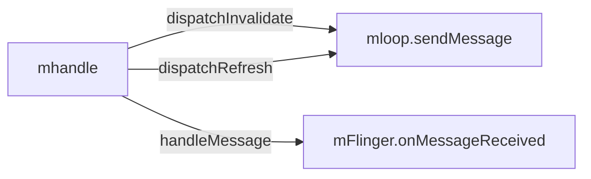
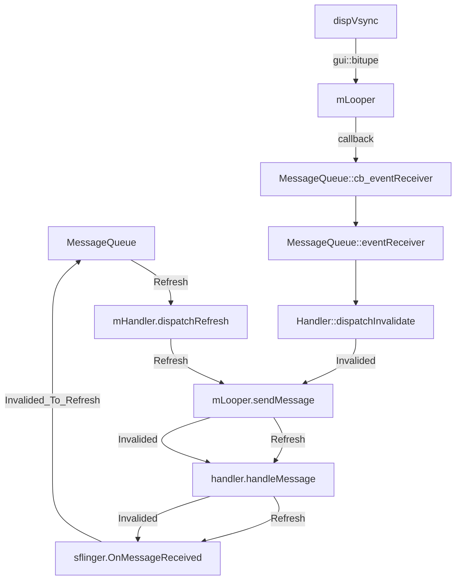
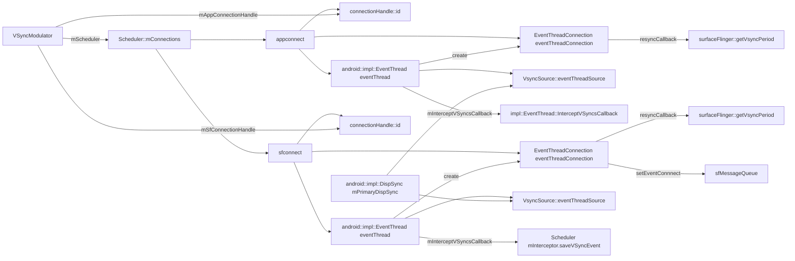
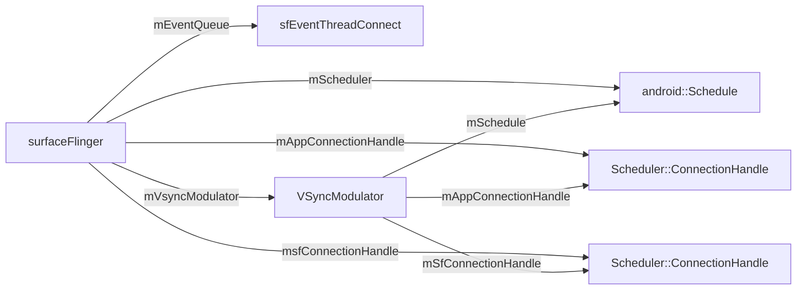
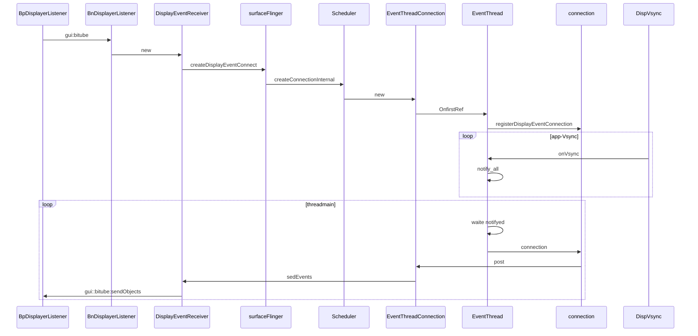
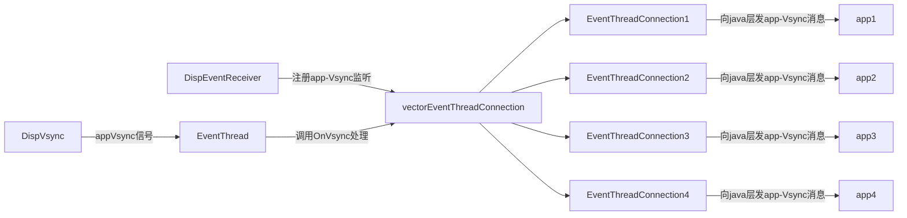
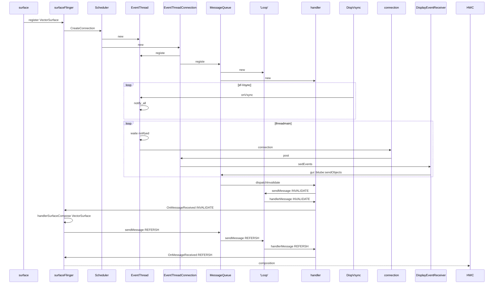
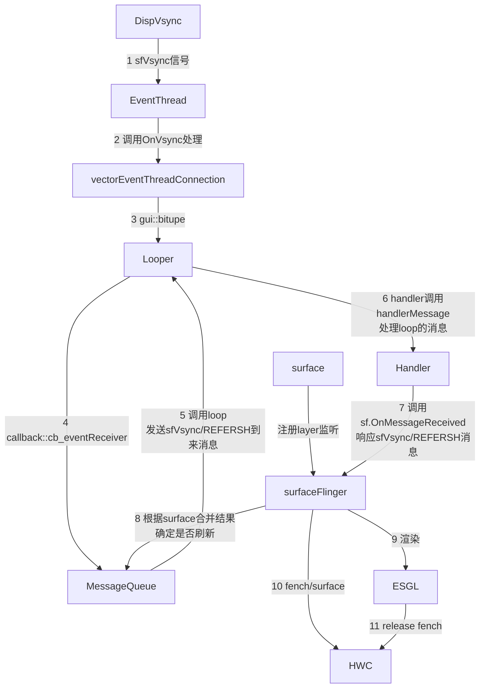

# androidQ surfaceflinger介绍

[toc]

*surfaceflinger是android系统的一个重要后台服务，该服务跟随系统启动，由systemservice服务启动。主要负责android的显示控制任务，本文主要介绍androidQ(android 10)系统中的surfaceflinger服务。*

---

## 综述

本文讲解的内容是Android4.1以后的系统机制，将从整体上分析Android图形显示系统的结构，不深入分析每一层内部的代码实现，更多的是使用流程图和结构图来让大家理解Android是如何绘制、合成图形并显示到屏幕上。

本文将从三个层次进行讲解，大致如下图：

可以理解为上层生产，下层消费模型。


可以理解为上层生产，下层消费模型。

其中每一层之间的数据传递是使用Buffer（图形缓冲区）作为载体：

这里的缓冲区，大家可以理解为带有宽高和像素密度的内存区块。

### 从下层往上层理解

####  显示屏

显示屏上的内容，是从硬件帧缓冲区读取的，大致读取过程为：从Buffer的起始地址开始，从上往下，从左往右扫描整个Buffer，将内容映射到显示屏上：


当然，屏幕上的内容需要需要不断的更新，如果在同一个Buffer进行读取和写入（合成）操作，将会导致屏幕显示多帧内容。所以硬件层除了提供一个Buffer用于屏幕显示，还提供了一个Buffer用于后台的图形合成，也就是我们常说的双缓冲：


上图中包含两个缓冲区：
**前缓冲区：**用来显示内容到屏幕的帧缓冲区
**后缓冲区：**用于后台合成下一帧图形的帧缓冲区

假设前一帧显示完毕，后一帧准备好了，屏幕将会开始读取下一帧的内容，也就是开始读取上图中的后缓冲区的内容：


此时，前后缓冲区进行一次角色互换，之前的后缓冲区变为前缓冲区，进行图形的显示，之前的前缓冲区则变为后缓冲区，进行图形的合成。

然而，理想很丰满，现实很骨感，上面假设“当前一帧显示完毕，后一帧准备好了”的情况，在现实中这两个事件并非同时完成。那么，屏幕扫描缓冲区的速度和系统合成帧的速度之间有什么关系呢，带着这个疑惑我们看看下面两个概念：

**屏幕刷新率（HZ）：**代表屏幕在一秒内刷新屏幕的次数，Android手机一般为60HZ（也就是1秒刷新60帧，大约16.67毫秒刷新1帧）

**系统帧速率（FPS）：**代表了系统在一秒内合成的帧数，该值的大小由系统算法和硬件决定。

我们用以下两个假设来分析两者的关系：

① 屏幕刷新速率比系统帧速率快
此时，在前缓冲区内容全部映射到屏幕上之后，后缓冲区尚未准备好下一帧，屏幕将无法读取下一帧，所以只能继续显示当前一帧的图形，造成一帧显示多次，也就是卡顿。

② 系统帧速率比屏幕刷新率快
此时，屏幕未完全把前缓冲区的一帧映射到屏幕，而系统已经在后缓冲区准备好了下一帧，并要求读取下一帧到屏幕，将会导致屏幕上半部分是上一帧的图形，而下半部分是下一帧的图形，造成屏幕上显示多帧，也就是屏幕撕裂。

上面两种情况，都会导致问题，根本原因就是两个缓冲区的操作速率不一致，解决办法就是让屏幕控制前后缓冲区的切换，让系统帧速率配合屏幕刷新率的节奏。

那么屏幕是如何控制这个节奏的呢？

**垂直同步（VSync）：**当屏幕从缓冲区扫描完一帧到屏幕上之后，开始扫描下一帧之前，发出的一个同步信号，该信号用来切换前缓冲区和后缓冲区。

通过上面的分析可以看出，屏幕的显示节奏是固定的，操作系统需要配合屏幕的显示，在固定的时间内准备好下一帧，以供屏幕进行显示。两者通过VSync信号来实现同步。

关于屏幕这一块的知识点讲解到这，不再深入分析，接下来我们将会了解后缓冲区的图形合成者。

#### SurfaceFlinger-图形合成者

如果说屏幕是消费者，那么SurfaceFlinger相对屏幕来说就是生产者，其具有如下特性：

- 作为上层应用的消费者，硬件层的生产者。
- 负责图形的合成
- 和ActivityManagerService一样，是一个系统服务

为了更好的理解SurfaceFlinger这个服务的工作内容，以及他是如何做到一个承上启下的作用，我们通过下面的这个界面分析：


界面很简单，拆开来看，包含微信、悬浮工具箱、通知栏、底部虚拟按键栏：


我们可以先这样理解上面这幅图，上层每一个界面，其实都对应SufaceFlinger里的一个Surface对象，上层将自己的内容绘制在对应的Surface内，接着，SufaceFlinger需要将所有上层对应的Surface内的图形进行合成，具体看下图：


没错，SurfaceFlinger就是将多个Surface里的内容进行合成，最后提交到屏幕的后缓冲区，等待屏幕的下一个垂直同步信号的到来，再显示到屏幕上。

我们会发现SufaceFlinger通过屏幕后缓冲区与屏幕建立联系。同时通过Surface与上层建立联系。从而起到一个承上启下的作用，是Android图形系统结构中的关键组成部分。

为了继续往上层讲，我们需要了解什么是Surface：

* 对应上层的一个Window（对话框、Activity、状态栏）
* 作为上层图形绘制的画板
* Canvas是画笔，上层通过调用Canvas的API向Surface上绘制图形
* Surface内部存在多个缓冲区，形成一个BufferQueue

如果说SurfaceFinger是图形的合成者，那么图形的提供者就是上层。文章一开始就提到，图形的传递是通过Buffer作为载体，Surface是对Buffer的进一步封装，也就是说Surface内部具有多个Buffer供上层使用，如何管理这些Buffer呢？请看下面这个模型：


Surface内部提供一个BufferQueue，与上层和SurfaceFlinger形成一个生产者消费者模型，上层对应Producer，SurfaceFlinger对应Consumer。三者通过Buffer产生联系，每个Buffer都有四种状态：

* Free：可被上层使用
* Dequeued：出列，正在被上层使用
* Queued：入列，已完成上层绘制，等待SurfaceFlinger合成
* Acquired：被获取，SurfaceFlinger正持有该Buffer进行合成

Buffer的一次转移过程大致为：

从BufferQueue转移到上层

* 上层绘制完成再放回BufferQueue
* 接着SurfaceFlinger再拿去合成
* 最后又放回BufferQueue
* 如此循环，形成一个Buffer被循环使用的过程。

关于SurfaceFlinger以及SurfaceFlinger与上层建立联系的Surface讲解完了，接下来看看上层是如何将图形绘制到Surface的Buffer中。

#### 上层绘图

上层绘图的大体流程见下图：


之前有说到，Surface里的Buffer作为上层的画板，Canvas作为画笔，通过调用Canvas的API完成图形的绘制，上层通过调用draw方法来调用Canvas的API，当然这里的draw方法并没有真正的将图形绘制到缓冲区，而是记录了一下绘制命令，具体需要了解DisplayList相关只是，后面会对其进行分析。

从流程上看:

1. 测量View的宽高（Measure）
2. 设置View的宽高位置（Layout）
3. 创建显示列表，并执行绘制（Draw）
4. 生成多边形和纹理
5. 对多边形和纹理进行栅格化操作

从执行者的角度看：

1. CPU：Measure，Layout，纹理和多边形生成，发送纹理和多边形到GPU
2. GPU：将CPU生成的纹理和多边形进行栅格化以及合成

上面说的的纹理和多边形还有栅格化以及合成，这里不做具体的讲解，需要了解的是图形的绘制流程需要经过这些操作。从上面的分析可以看出，上层绘制图形时需要经过CPU计算，再经过GPU计算。

经过上面的分析，整个Android的图形绘制大体流程已经分析完成，接下来将会分析一些流程的具体实现，分析的内容包括：

* Android 4.1 加入的VSync信号同步到上层以及三缓冲
* 从上层往下层具体分析每一步流程
  

#### VSync以及三缓冲

#####  Drawing Without VSync

从上面的讲解可以看出，整个绘制流程的节奏，分成两个生产者消费者模型，一个由屏幕和SurfaceFlinger构成，另一个由SurfaceFlinger和上层应用构成，具体流程可以用下图来描述：


其中：

1. CPU和GPU代表上层的绘制执行者
2. Composite代表的是SurfaceFlinger对多个Surface的合成
3. Background Buffer和Front Buffer分别代表的是硬件帧缓冲区中的前缓冲和后缓冲
4. 显示屏扫描完一帧之后，会发出VSync信号来切换并显示下一帧

上面的流程中，存在一个问题，屏幕的VSync信号只是用来控制帧缓冲区的切换，并未控制上层的绘制节奏，也就是说上层的生产节奏和屏幕的显示节奏是脱离的：


上图中，横轴表示时间，纵轴表示Buffer的使用者，每个长方形表示Buffer的使用，长方形的宽度代表使用时长，VSync代表垂直同步信号，两个VSync信号之间间隔16.6ms。此图描述了Android在4.1系统版本之前，上层的绘图流程在没有VSync信号的时候，出现的绘制问题。

我们从时间为0开始看，当前屏幕显示第0帧，上层CPU开始计算第1帧的纹理，计算完成后，交由GPU进行栅格化。当下一个垂直同步信号到来，屏幕显示下一帧，这时候，上层CPU并未马上开始准备下一帧，而当CPU开始准备下一帧的时候已经太晚了，下一个VSync信号来临的时候，GPU未能绘制完第二帧的处理，导致屏幕再次显示上一帧，造成卡顿：


##### Drawing With VSync

因为上层不知道VSync信号已经发出，导致上层未能开始CPU的计算。google在Android 4.1系统中加入了上层接收垂直同步信号的逻辑，大致流程如下：


也就是说，屏幕在显示完一帧后，发出的垂直同步除了通知帧缓冲区的切换之外，该消息还会发送到上层，通知上层开始绘制下一帧。

那么，上层是如何接受这个VSync消息的呢？

###### Choreographer VSync信号的上层接收者

Google为上层设计了一个Choreographer类，翻译成中文是“编舞者”，是希望通过它来控制上层的绘制（舞蹈）节奏。

首先看看Choreographer的类图：


可以发现，Choreographer需要向SurfaceFlinger来注册一个VSync信号的接收器DisplayEventReceiver。同时在Choreographer的内部维护了一个CallbackQueue，用来保存上层关心VSync信号的组件，包括ViewRootImpl，TextView，ValueAnimator等。

再看看上层接收VSync的时序图：


知道了Choreographer是上层用来接收VSync的角色之后，我们需要进一步了解VSync信号是如何控制上层的绘制的：


一般，上层需要绘制新的UI都是因为View的requestLayout或者是invalidate方法被调用触发的，我们以这个为起点，跟踪上层View的绘制流程：

1. requestLayout或者invalidate触发更新视图请求
2. 更新请求传递到ViewRootImpl中，ViewRootImpl向主线程MessageQueue中加入一个阻塞器，该阻塞器将会拦截所有同步消息，也就是说此时，我们再通过Handler向主线程MessageQueue发送的所有Message都将无法被执行。
3. ViewRootImpl向Choreographer注册下一个VSync信号
4. Choreographer通过DisplayEventReceiver向framework层注册下一个VSync信号
5. 当底层产生下一个VSync消息时，该信号将会发送给DisplayEventReceiver，最后传递给Choreographer
6. Choreographer收到VSync信号之后，向主线程MessageQueue发送了一个异步消息，我们在第二步提到，ViewRootImpl向MessageQueue发送了一个同步消息阻塞器。这里Choreographer发送的异步消息，是不会被阻塞器拦截的。
7. 最后，异步消息的执行者是ViewRootImpl，也就是真正开始绘制下一帧了

至此，底层的VSync控制上层的逻辑就解释完了，此时上层绘制图形的流程与VSync信号的关系可以用下图表示：


时间从屏幕显示第0帧开始，CPU开始准备第1帧图形的处理，好了之后交给GPU进行处理，在上层收到下一个VSync之后，CPU立马开始第2帧的处理，上层绘图的节奏就和VSync信号保持一致了，整个绘图非常流畅。

然而，理想很丰满，现实很骨感，如果CPU和GPU没能在下一个VSync信号到来之前完成下一帧的绘制工作，又会是怎么样的呢？


还是从屏幕显示第A帧开始，时间进入第一个16.6ms，CPU和GPU合成第B帧，当下一个VSync信号到来的时候，GPU未能及时完成第B帧的绘制，此时，GPU占有一个Surface里的Buffer，而同时SurfaceFlinger又持有一个Buffer用于合成显示下一帧到屏幕，这样的话，就导致Surface里的两个缓冲区都被占用了。此时SurfaceFlinger只能使用第A帧已经准备好的Buffer来合成，GPU继续在另一个缓冲区中合成第B帧，此时CPU无法开始下一帧的合成，因为缓冲区用完了。另外一个不好的事情是CPU只有在VSync信号来的时候才开始绘制下一帧，也是就是说在第二个16.6ms时间内，CPU一直处于空闲状态，未进行下一帧的计算。
只有等到第二个VSync信号来了之后，CPU才开始在绘制下一帧。如果CPU和GPU需要合成的图形太多，将会导致连续性的卡顿，如果CPU和GPU大部分时候都无法在16.6ms完成一帧的绘制，将会导致连续的卡顿现象。

别着急，请看看Google的决绝方案。

#####  parallel processing and triple buffering

没错，就是加入第三个Buffer，CPU和GPU还有SurfaceFlinger各占一个Buffer，并行处理图形：


从上图可以看出，在第一个VSync到来时，尽管SurfaceFlinger占了一个Buffer，GPU又占了一个Buffer，CPU仍然可以在第三个Buffer中开始下一帧的计算，整个显示过程就开始时卡顿了一帧，之后都是流畅的。

当然系统并非一直开启三个Buffer，因为Buffer是需要消耗资源的，并且，我们会发现，上图中，GPU处理好的图形，需要跨越两个VSync信号，才能显示。这样的话，给用户的影响是一个延迟的现象。

为了解决该问题，我们需要再次从上层往下层了解Android绘制图形的各个细节，并进行优化。对于应用程序开发人员来说，重点还是上层的优化，对自己的应用程序的内存，UI，数据等进行优化。

总结：

* Android通过Buffer来保存图形信息，为了让图形显示的更加流程，在提供一一个Buffer用于显示的同时，开辟一个或者多个Buffer用于后台图形的合成。
* Android4.1之前，VSync信号并未传递给上层，导致生产与消费节奏不统一
* Android4.1之后，上层开始绘制时机都放到了VSync信号的到来时候
* 除了在上层引入VSync机制，Anroid在4.1还加入了三缓冲，用来减少卡顿的产生
* 每个Surface都有自己的绘制流程，需要先经过CPU处理，再经过GPU处理，之后经过SurfaceFlinger与其他Surface绘制好的图形和合成在一起，供屏幕显示
* VSync信号贯穿整个绘制流程，控制着整个Android图形系统的节奏

*综述转自:[Android图形显示系统](https://blog.csdn.net/a740169405/article/details/70548443)*

##启动surfaceflinger

### rc文件配置

surfaceflinger启动是在系统开机时，由系统systemservice负责启动，启动相关的控制在surfaceflinger.rc中*[rc语法](init.rc 语法与解析)*。

```c
service surfaceflinger /system/bin/surfaceflinger //服务启动的命令
    class core animation //服务指定的class名，同一个class 的所有服务必须同时启动或者停止。
    user system //在启动服务前将用户切换至<system>,默认情况下用户都是root。
    group graphics drmrpc readproc //在启动服务前将用户组切换至<groupname>
    onrestart restart zygote //当次服务重启时，执行某些命令
    writepid /dev/stune/foreground/tasks //当fork一个子进程时，写子进程的pid到一个给定的文件。是给cgroup/cpuset使用
    //创建一个名为pdx/system/vr/display/<name>的 socket，然后将它的fd值传给启动它的进，有效的<type>值包括dgram,stream 和seqpacket。ueser 和group 的默认值为0
    socket pdx/system/vr/display/client     stream 0666 system graphics u:object_r:pdx_display_client_endpoint_socket:s0
    socket pdx/system/vr/display/manager    stream 0666 system graphics u:object_r:pdx_display_manager_endpoint_socket:s0
    socket pdx/system/vr/display/vsync      stream 0666 system graphics u:object_r:pdx_display_vsync_endpoint_socket:s0
    critical //是否关键，也就是4分钟之内重启超过4次的话，重启之后就进入recovery模式
```

###  surfaceflinger对象创建

surfaceflinger启动服务的入口函数是main_surfaceflinger.cpp的main函数

[->main_surfaceflinger.cpp]

```c
int main(int, char**) {
    signal(SIGPIPE, SIG_IGN);

    hardware::configureRpcThreadpool(1 /* maxThreads */,
            false /* callerWillJoin */);

    startGraphicsAllocatorService();

    // When SF is launched in its own process, limit the number of
    // binder threads to 4.设置该线程可以绑定的binder线程数（binder用于通信）
    ProcessState::self()->setThreadPoolMaxThreadCount(4);

    // start the thread pool 启动线程池
    sp<ProcessState> ps(ProcessState::self());
    ps->startThreadPool();

    // instantiate surfaceflinger 实例化surfacefinger线程
    sp<SurfaceFlinger> flinger = surfaceflinger::createSurfaceFlinger();
	//设置线程优先级
    setpriority(PRIO_PROCESS, 0, PRIORITY_URGENT_DISPLAY);
	//设置调度策略
    set_sched_policy(0, SP_FOREGROUND);

    // Put most SurfaceFlinger threads in the system-background cpuset
    // Keeps us from unnecessarily using big cores
    // Do this after the binder thread pool init 设置cpu后台运行策略，避免使用大核
    if (cpusets_enabled()) setCpusetPolicy();

    // initialize before clients can connect
    flinger->init();
	
    // publish surface flinger 添加surfaceflinger服务到服务管理单元
    sp<IServiceManager> sm(defaultServiceManager());
    sm->addService(String16(SurfaceFlinger::getServiceName()), flinger, false,
                   IServiceManager::DUMP_FLAG_PRIORITY_CRITICAL | IServiceManager::DUMP_FLAG_PROTO);
	//启动显示服务
    startDisplayService(); // dependency on SF getting registered above

    struct sched_param param = {0};
    param.sched_priority = 2;
    if (sched_setscheduler(0, SCHED_FIFO, &param) != 0) {
        ALOGE("Couldn't set SCHED_FIFO");
    }

    // run surface flinger in this thread
    flinger->run();

    return 0;
}
```

main函数主要工作;

1. 启动内存管理相关服务。
2. 设置surfaceflinger的binder线程池大小，启动binder线程池。
3. 创建surfaceflinger实例，设置调度策略和优先级。
4. 调用surfaceflinger的init函数初始化实例。
5. 添加surfaceflinger服务到系统服务管理模块。
6. 启动显示服务。
7. 运行surfaceflinger服务。

binder线程是用于线程间通信的class，相关文档可以[参考此文档](https://blog.csdn.net/llping2011/article/details/9706679);由于本文重点介绍surfaceflinger模块，所以接下来主要介绍一下创建surfaceflinger实例。

####  创建surfaceflinger实例

surfaceflinger实例通过**surfaceflinger::createSurfaceFlinger()**函数创建，该函数位于SurfaceFlingerFactory.cpp中，定义如下

```c++
namespace android::surfaceflinger {

sp<SurfaceFlinger> createSurfaceFlinger() {
    class Factory final : public surfaceflinger::Factory {
    public:
        Factory() = default;
        ~Factory() = default;

        std::unique_ptr<DispSync> createDispSync(const char* name, bool hasSyncFramework,
                                                 int64_t dispSyncPresentTimeOffset) override {
            // Note: We create a local temporary with the real DispSync implementation
            // type temporarily so we can initialize it with the configured values,
            // before storing it for more generic use using the interface type.
            auto primaryDispSync = std::make_unique<android::impl::DispSync>(name);
            primaryDispSync->init(hasSyncFramework, dispSyncPresentTimeOffset);
            return primaryDispSync;
        }

        std::unique_ptr<EventControlThread> createEventControlThread(
                std::function<void(bool)> setVSyncEnabled) override {
            return std::make_unique<android::impl::EventControlThread>(setVSyncEnabled);
        }

        std::unique_ptr<HWComposer> createHWComposer(const std::string& serviceName) override {
            return std::make_unique<android::impl::HWComposer>(
                    std::make_unique<Hwc2::impl::Composer>(serviceName));
        }

        std::unique_ptr<MessageQueue> createMessageQueue() override {
            return std::make_unique<android::impl::MessageQueue>();
        }

        std::unique_ptr<scheduler::PhaseOffsets> createPhaseOffsets() override {
            return std::make_unique<scheduler::impl::PhaseOffsets>();
        }

        std::unique_ptr<Scheduler> createScheduler(
                std::function<void(bool)> callback,
                const scheduler::RefreshRateConfigs& refreshRateConfig) override {
            return std::make_unique<Scheduler>(callback, refreshRateConfig);
        }

        std::unique_ptr<SurfaceInterceptor> createSurfaceInterceptor(
                SurfaceFlinger* flinger) override {
            return std::make_unique<android::impl::SurfaceInterceptor>(flinger);
        }

        sp<StartPropertySetThread> createStartPropertySetThread(
                bool timestampPropertyValue) override {
            return new StartPropertySetThread(timestampPropertyValue);
        }

        sp<DisplayDevice> createDisplayDevice(DisplayDeviceCreationArgs&& creationArgs) override {
            return new DisplayDevice(std::move(creationArgs));
        }

        sp<GraphicBuffer> createGraphicBuffer(uint32_t width, uint32_t height, PixelFormat format,
                                              uint32_t layerCount, uint64_t usage,
                                              std::string requestorName) override {
            return new GraphicBuffer(width, height, format, layerCount, usage, requestorName);
        }

        void createBufferQueue(sp<IGraphicBufferProducer>* outProducer,
                               sp<IGraphicBufferConsumer>* outConsumer,
                               bool consumerIsSurfaceFlinger) override {
            BufferQueue::createBufferQueue(outProducer, outConsumer, consumerIsSurfaceFlinger);
        }

        std::unique_ptr<surfaceflinger::NativeWindowSurface> createNativeWindowSurface(
                const sp<IGraphicBufferProducer>& producer) override {
            return surfaceflinger::impl::createNativeWindowSurface(producer);
        }

        std::unique_ptr<compositionengine::CompositionEngine> createCompositionEngine() override {
            return compositionengine::impl::createCompositionEngine();
        }

        sp<ContainerLayer> createContainerLayer(const LayerCreationArgs& args) override {
            return new ContainerLayer(args);
        }

        sp<BufferQueueLayer> createBufferQueueLayer(const LayerCreationArgs& args) override {
            return new BufferQueueLayer(args);
        }

        sp<BufferStateLayer> createBufferStateLayer(const LayerCreationArgs& args) override {
            return new BufferStateLayer(args);
        }

        sp<ColorLayer> createColorLayer(const LayerCreationArgs& args) override {
            return new ColorLayer(args);
        }

        std::shared_ptr<TimeStats> createTimeStats() override {
            return std::make_shared<android::impl::TimeStats>();
        }
    };
    static Factory factory;

    return new SurfaceFlingerEx(factory);
}

} 
```

createSurfaceFlinger函数**首先**定义了Factory类，该类派生于surfaceflinger::Factory,实现了父类定义的所有虚函数。通过函数名可以知道，该类主要用于创建surfaceflinger中的类成员变量的实例。**接着**定义一个Factory实例，最后返回一个通过Factory实例创建的SurfaceFlingerEx对象。

####  SurfaceFlinger和SurfaceFlingerEx

surfaceFlingerEx类是surfaceFlinger的之类，这个是由各个厂家自己定义的，除了继承SurfaceFlinger类的方法外，还根据各个厂家的产品自己增加了一些扩展。我司SurfaceFlingerEx的定义请自行于源码中搜索[SurfaceFlingerEx.h](./vendor/huawei/Emui/frameworks/hwCommInterface/include/SurfaceFlingerEx.h)和[SurfaceFlingerEx.cpp](./vendor/huawei/Emui/frameworks/native/services/surfaceflinger/SurfaceFlingerEx.cpp)查看。我们只看surfaceFlinger类。

[->surfaceflinger.cpp]

```C++
SurfaceFlinger::SurfaceFlinger(Factory& factory, SkipInitializationTag)
      : mFactory(factory),
        mPhaseOffsets(mFactory.createPhaseOffsets()),
        mInterceptor(mFactory.createSurfaceInterceptor(this)),
        mTimeStats(mFactory.createTimeStats()),
        mEventQueue(mFactory.createMessageQueue()),
        skipScrnRecDelay(false),
        skipScreenRecord(0),
        mShotSkipVAssistLayer(0),
        mKnuckleScreenShot(0),
        mRogWidth(0),
        mRogHeight(0),
        mRogFeature(0),
        mIsSdrSupported(false),
        mPrimaryConfigSize(0),
        mLastSDRComposeWidth(0),
        mLastSDRComposeHeight(0),
        mCompositionEngine(mFactory.createCompositionEngine()),
        // hisi Xsync and PreComposite opt
        mSuppressTouchSync(false),
        mTouchSyncOn(false),
        mLargeLayerCount(0),
        mIsTouchMode(false),
        mVsyncEnabled(false),
        mDownAppSfOffsetWorkFlag(false),
        mFrameRateOptSwitch(false) {
    mItouchToSurfaceflingerInfo.firstFrameOpt = false;
    mItouchToSurfaceflingerInfo.backPressureOpt = false;
    mItouchToSurfaceflingerInfo.backPressureCount = BACKPRESSURE_INIT_COUNT;
    mItouchToSurfaceflingerInfo.backPressureCountMax = BACKPRESSURE_COUNT_MAX;
}

SurfaceFlinger::SurfaceFlinger(Factory& factory) : SurfaceFlinger(factory, SkipInitialization) {
    ALOGI("SurfaceFlinger is starting");

    hasSyncFramework = running_without_sync_framework(true);

    dispSyncPresentTimeOffset = present_time_offset_from_vsync_ns(0);

    useHwcForRgbToYuv = force_hwc_copy_for_virtual_displays(false);

    maxVirtualDisplaySize = max_virtual_display_dimension(0);

    // Vr flinger is only enabled on Daydream ready devices.
    useVrFlinger = use_vr_flinger(false);

    maxFrameBufferAcquiredBuffers = max_frame_buffer_acquired_buffers(2);

    hasWideColorDisplay = has_wide_color_display(false);

    useColorManagement = use_color_management(false);

    mDefaultCompositionDataspace =
            static_cast<ui::Dataspace>(default_composition_dataspace(Dataspace::V0_SRGB));
    mWideColorGamutCompositionDataspace = static_cast<ui::Dataspace>(wcg_composition_dataspace(
            hasWideColorDisplay ? Dataspace::DISPLAY_P3 : Dataspace::V0_SRGB));
    defaultCompositionDataspace = mDefaultCompositionDataspace;
    wideColorGamutCompositionDataspace = mWideColorGamutCompositionDataspace;
    defaultCompositionPixelFormat = static_cast<ui::PixelFormat>(
            default_composition_pixel_format(ui::PixelFormat::RGBA_8888));
    wideColorGamutCompositionPixelFormat =
            static_cast<ui::PixelFormat>(wcg_composition_pixel_format(ui::PixelFormat::RGBA_8888));

    useContextPriority = use_context_priority(true);

    auto tmpPrimaryDisplayOrientation = primary_display_orientation(
            SurfaceFlingerProperties::primary_display_orientation_values::ORIENTATION_0);
    switch (tmpPrimaryDisplayOrientation) {
        case SurfaceFlingerProperties::primary_display_orientation_values::ORIENTATION_90:
            SurfaceFlinger::primaryDisplayOrientation = DisplayState::eOrientation90;
            break;
        case SurfaceFlingerProperties::primary_display_orientation_values::ORIENTATION_180:
            SurfaceFlinger::primaryDisplayOrientation = DisplayState::eOrientation180;
            break;
        case SurfaceFlingerProperties::primary_display_orientation_values::ORIENTATION_270:
            SurfaceFlinger::primaryDisplayOrientation = DisplayState::eOrientation270;
            break;
        default:
            SurfaceFlinger::primaryDisplayOrientation = DisplayState::eOrientationDefault;
            break;
    }
    ALOGV("Primary Display Orientation is set to %2d.", SurfaceFlinger::primaryDisplayOrientation);

    mInternalDisplayPrimaries = sysprop::getDisplayNativePrimaries();

    // debugging stuff...
    char value[PROPERTY_VALUE_MAX];

    property_get("ro.bq.gpu_to_cpu_unsupported", value, "0");
    mGpuToCpuSupported = !atoi(value);

    property_get("debug.sf.showupdates", value, "0");
    mDebugRegion = atoi(value);

    ALOGI_IF(mDebugRegion, "showupdates enabled");

    // DDMS debugging deprecated (b/120782499)
    property_get("debug.sf.ddms", value, "0");
    int debugDdms = atoi(value);
    ALOGI_IF(debugDdms, "DDMS debugging not supported");

    property_get("debug.sf.disable_backpressure", value, "0");
    mPropagateBackpressure = !atoi(value);
    ALOGI_IF(!mPropagateBackpressure, "Disabling backpressure propagation");

    property_get("debug.sf.enable_gl_backpressure", value, "0");
    mPropagateBackpressureClientComposition = atoi(value);
    ALOGI_IF(mPropagateBackpressureClientComposition,
             "Enabling backpressure propagation for Client Composition");

    property_get("debug.sf.enable_hwc_vds", value, "0");
    mUseHwcVirtualDisplays = atoi(value);
    ALOGI_IF(mUseHwcVirtualDisplays, "Enabling HWC virtual displays");

    property_get("ro.sf.disable_triple_buffer", value, "0");
    mLayerTripleBufferingDisabled = atoi(value);
    ALOGI_IF(mLayerTripleBufferingDisabled, "Disabling Triple Buffering");

    property_get("debug.sf.partialCompose", value, "1");
    mUsePartialCompose = atoi(value);
    ALOGI_IF(!mUsePartialCompose, "Disable partial compose");

    const size_t defaultListSize = MAX_LAYERS;
    auto listSize = property_get_int32("debug.sf.max_igbp_list_size", int32_t(defaultListSize));
    mMaxGraphicBufferProducerListSize = (listSize > 0) ? size_t(listSize) : defaultListSize;

    mUseSmart90ForVideo = use_smart_90_for_video(false);
    property_get("debug.sf.use_smart_90_for_video", value, "0");

    int int_value = atoi(value);
    if (int_value) {
        mUseSmart90ForVideo = true;
    }

    property_get("debug.sf.luma_sampling", value, "1");
    mLumaSampling = atoi(value);

    const auto [early, gl, late] = mPhaseOffsets->getCurrentOffsets();
    mVsyncModulator.setPhaseOffsets(early, gl, late);

    // We should be reading 'persist.sys.sf.color_saturation' here
    // but since /data may be encrypted, we need to wait until after vold
    // comes online to attempt to read the property. The property is
    // instead read after the boot animation
    // hisi Xsync and PreComposite opt
    property_get("persist.kirin.touch_vsync_opt", value, "0");
    mTouchVsyncOpt = atoi(value);
    ALOGI_IF(mTouchVsyncOpt, "Touch Vsync opt enabled");

    if (useTrebleTestingOverride()) {
        // Without the override SurfaceFlinger cannot connect to HIDL
        // services that are not listed in the manifests.  Considered
        // deriving the setting from the set service name, but it
        // would be brittle if the name that's not 'default' is used
        // for production purposes later on.
        setenv("TREBLE_TESTING_OVERRIDE", "true", true);
    }

    GameExLayer::CreateWorkerThread();
    xcollie_init();
}
```

通过构造函数SurfaceFlinger(Factory& factory)创建对象，该构造函数先通过SurfaceFlinger(Factory& factory, SkipInitializationTag)初始化部分成员变量，然后自己再配置SurfaceFlinger的相关属性参数。其中比较重要的是通过factory对象初始化的变量，如下

> mFactory(factory)
> mPhaseOffsets(mFactory.createPhaseOffsets())
> mInterceptor(mFactory.createSurfaceInterceptor(this))
> mTimeStats(mFactory.createTimeStats())
> mEventQueue(mFactory.createMessageQueue())
> mCompositionEngine(mFactory.createCompositionEngine())

###  SurfaceFlinger初始化

####  OnFistRef调用

在main_SurfaceFlinger.cpp文件的main函数中可以看到，实例初始化代码是**sp<SurfaceFlinger> flinger = surfaceflinger::createSurfaceFlinger()**，这里使用的是sp强引用，根据C++11的新特性可知，在使用强引用时，会自动调用对象的OnFistRef函数。SurfaceFlinger类重定义了OnFistRef函数如下：

```c++
void SurfaceFlinger::onFirstRef()
{
    mEventQueue->init(this);
}
```

onFirstRef函数主要是初始化了mEventQueue，mEventQueue主要作用是线程间发送接收消息。

因为mEnentQueue是通过mFactory创建的，而mFactory对应的类是在createSurfaceFlinger函数中定义的，所以mFactory相关的操作都可以到createSurfaceFlinger中去找，此处从createMessageQueue()函数可知mEventQueue是android::impl::MessageQueue()类的实例。

##### mEventQueue

mEventQueue->init(this)中this及surfaceFlinger对象本身，mEventQueue->init(this)代码如下：

[->MessageQueue.cpp]

```c++
void MessageQueue::init(const sp<SurfaceFlinger>& flinger) {
    mFlinger = flinger;
    mLooper = new Looper(true);
    mHandler = new Handler(*this);
}
```

init函数保存了surfaceFlinger对象，同时创建了一个looper对象和一个Handler对象。

looper是android的looper类，可以[参考此文档](http://gityuan.com/2015/12/27/handler-message-native/)。

Handler继承与MeeeageHandler类，声明和定义如下：

[->MEssageQueue.h]

```c++
class MessageQueue final : public android::MessageQueue {
    class Handler : public MessageHandler {
        enum { eventMaskInvalidate = 0x1, eventMaskRefresh = 0x2, eventMaskTransaction = 0x4 };
        MessageQueue& mQueue;
        int32_t mEventMask;

    public:
        explicit Handler(MessageQueue& queue) : mQueue(queue), mEventMask(0) {}
        virtual void handleMessage(const Message& message);
        void dispatchRefresh();
        void dispatchInvalidate();
    };
```

[->MessageQueue.cpp]

```c++
void MessageQueue::Handler::dispatchRefresh() {
    if ((android_atomic_or(eventMaskRefresh, &mEventMask) & eventMaskRefresh) == 0) {
        mQueue.mLooper->sendMessage(this, Message(MessageQueue::REFRESH));
    }
}

void MessageQueue::Handler::dispatchInvalidate() {
    if ((android_atomic_or(eventMaskInvalidate, &mEventMask) & eventMaskInvalidate) == 0) {
        mQueue.mLooper->sendMessage(this, Message(MessageQueue::INVALIDATE));
    }
}

void MessageQueue::Handler::handleMessage(const Message& message) {
    switch (message.what) {
        case INVALIDATE:
            android_atomic_and(~eventMaskInvalidate, &mEventMask);
            mQueue.mFlinger->onMessageReceived(message.what);
            break;
        case REFRESH:
            android_atomic_and(~eventMaskRefresh, &mEventMask);
            mQueue.mFlinger->onMessageReceived(message.what);
            break;
    }
}
```

可以看到，mHandle主要用于处理message，对象保存了mEventQueue和msurfaceFlinger对象。

mEventQueue中mFlinger，mlooper，mhandler之间关系如下：



简单描述上述关系是：mEventQueue是SurfaceFlinger的消息管理队列，SurfaceFlinger通过mEventQueue管理消息，mEventQueue又通过mhandle处理消息，其中mhandle通过mlooper发送消息，通过回调SurfaceFlinger的OnMessageReceived函数处理消息。

*从MessageQueue的代码看，SurfaceFlinger只是通过MessageQueue的looper发送消息，并没用mHandle的handleMessage处理消息，也就是说SurfaceFlinger的OnMessageReceived函数并没有被MessageQueue的mHandle变量调用，那么被谁调用了呢？其实，handleMessage是被looper自动调用的，handler线程被注册到looper线程，loop线程自动调用handler.handleMessage*




####  init初始化

surfaceFlinger的init代码如下：

[->surfaceFlinger.cpp]

```c++
void SurfaceFlinger::init() {
    ALOGI(  "SurfaceFlinger's main thread ready to run. "
            "Initializing graphics H/W...");

    ALOGI("Phase offset NS: %" PRId64 "", mPhaseOffsets->getCurrentAppOffset());

    Mutex::Autolock _l(mStateLock);
    // start the EventThread
    mScheduler =
            getFactory().createScheduler([this](bool enabled) { setPrimaryVsyncEnabled(enabled); },
                                         mRefreshRateConfigs);
    auto resyncCallback =
            mScheduler->makeResyncCallback(std::bind(&SurfaceFlinger::getVsyncPeriod, this));

    mAppConnectionHandle =
            mScheduler->createConnection("app", mPhaseOffsets->getCurrentAppOffset(),
                                         resyncCallback,
                                         impl::EventThread::InterceptVSyncsCallback());
    mSfConnectionHandle = mScheduler->createConnection("sf", mPhaseOffsets->getCurrentSfOffset(),
                                                       resyncCallback, [this](nsecs_t timestamp) {
                                                           mInterceptor->saveVSyncEvent(timestamp);
                                                       });
	//把sf时钟的回调数据与mEventQueue的looper线程联系在一起
    mEventQueue->setEventConnection(mScheduler->getEventConnection(mSfConnectionHandle));
    mVsyncModulator.setSchedulerAndHandles(mScheduler.get(), mAppConnectionHandle.get(),
                                           mSfConnectionHandle.get());

    mRegionSamplingThread =
            new RegionSamplingThread(*this, *mScheduler,
                                     RegionSamplingThread::EnvironmentTimingTunables());

    // Get a RenderEngine for the given display / config (can't fail)
    int32_t renderEngineFeature = 0;
    renderEngineFeature |= (useColorManagement ?
                            renderengine::RenderEngine::USE_COLOR_MANAGEMENT : 0);
    renderEngineFeature |= (useContextPriority ?
                            renderengine::RenderEngine::USE_HIGH_PRIORITY_CONTEXT : 0);
    renderEngineFeature |=
            (enable_protected_contents(false) ? renderengine::RenderEngine::ENABLE_PROTECTED_CONTEXT
                                              : 0);

    // TODO(b/77156734): We need to stop casting and use HAL types when possible.
    // Sending maxFrameBufferAcquiredBuffers as the cache size is tightly tuned to single-display.
    mCompositionEngine->setRenderEngine(
            renderengine::RenderEngine::create(static_cast<int32_t>(defaultCompositionPixelFormat),
                                               renderEngineFeature,
                                               maxFrameBufferAcquiredBuffers + mPartialComposeCacheSize));

    LOG_ALWAYS_FATAL_IF(mVrFlingerRequestsDisplay,
            "Starting with vr flinger active is not currently supported.");
    //通过HWC::impl:Composer创建android::impl::Composer实例
    mCompositionEngine->setHwComposer(getFactory().createHWComposer(getBE().mHwcServiceName));
    //向HWC::impl::Composer注册三个回调函数。
    mCompositionEngine->getHwComposer().registerCallback(this, getBE().mComposerSequenceId);
    // Process any initial hotplug and resulting display changes.
    //处理初始化时的热插拔消息。
    processDisplayHotplugEventsLocked();
    //获取显示设备的ID
    const auto display = getDefaultDisplayDeviceLocked();
    LOG_ALWAYS_FATAL_IF(!display, "Missing internal display after registering composer callback.");
    LOG_ALWAYS_FATAL_IF(!getHwComposer().isConnected(*display->getId()),
                        "Internal display is disconnected.");

    if (useVrFlinger) {
        auto vrFlingerRequestDisplayCallback = [this](bool requestDisplay) {
            // This callback is called from the vr flinger dispatch thread. We
            // need to call signalTransaction(), which requires holding
            // mStateLock when we're not on the main thread. Acquiring
            // mStateLock from the vr flinger dispatch thread might trigger a
            // deadlock in surface flinger (see b/66916578), so post a message
            // to be handled on the main thread instead.
            postMessageAsync(new LambdaMessage([=] {
                ALOGI("VR request display mode: requestDisplay=%d", requestDisplay);
                mVrFlingerRequestsDisplay = requestDisplay;
                signalTransaction();
            }));
        };
        mVrFlinger = dvr::VrFlinger::Create(getHwComposer().getComposer(),
                                            getHwComposer()
                                                    .fromPhysicalDisplayId(*display->getId())
                                                    .value_or(0),
                                            vrFlingerRequestDisplayCallback);
        if (!mVrFlinger) {
            ALOGE("Failed to start vrflinger");
        }
    }

    // initialize our drawing state
    mDrawingState = mCurrentState;

    // set initial conditions (e.g. unblank default device)
    //发送异步消息，初始化设备
    initializeDisplays();

    getRenderEngine().primeCache();

    // Inform native graphics APIs whether the present timestamp is supported:
	//创建启动动画线程
    const bool presentFenceReliable =
            !getHwComposer().hasCapability(HWC2::Capability::PresentFenceIsNotReliable);
    mStartPropertySetThread = getFactory().createStartPropertySetThread(presentFenceReliable);
	//启动开机动画线程
    if (mStartPropertySetThread->Start() != NO_ERROR) {
        ALOGE("Run StartPropertySetThread failed!");
    }
	//配置刷新了改变回调函数
    mScheduler->setChangeRefreshRateCallback(
            [this](RefreshRateType type, Scheduler::ConfigEvent event) {
                Mutex::Autolock lock(mStateLock);
                setRefreshRateTo(type, event);
            });
    //配置周期获取回调函数
    mScheduler->setGetVsyncPeriodCallback([this] {
        Mutex::Autolock lock(mStateLock);
        return getVsyncPeriod();
    });
	//保存当前刷新了参数
    mRefreshRateConfigs.populate(getHwComposer().getConfigs(*display->getId()));
    mRefreshRateStats.setConfigMode(getHwComposer().getActiveConfigIndex(*display->getId()));

    // obtain hwvsync period and initial vsync offset
    sfFrameInfo.intialSfVsyncOffset = ns2ms(mPhaseOffsets->getCurrentSfOffset());
    // ns transfer ms for float type
    sfFrameInfo.hwVsyncPeriod = getVsyncPeriod() / 1000000.0;
    ALOGV("Done initializing");
}
```

代码有点长，我们慢慢看，

**mScheduler**

```c++
    mScheduler =
            getFactory().createScheduler([this](bool enabled) { setPrimaryVsyncEnabled(enabled); },
                                         mRefreshRateConfigs);
    auto resyncCallback =
            mScheduler->makeResyncCallback(std::bind(&SurfaceFlinger::getVsyncPeriod, this));

    mAppConnectionHandle =
            mScheduler->createConnection("app", mPhaseOffsets->getCurrentAppOffset(),
                                         resyncCallback,
                                         impl::EventThread::InterceptVSyncsCallback());
    mSfConnectionHandle = mScheduler->createConnection("sf", mPhaseOffsets->getCurrentSfOffset(),
                                                       resyncCallback, [this](nsecs_t timestamp) {
                                                           mInterceptor->saveVSyncEvent(timestamp);
                                                       });
```

创建Scheduler实例，两个入参：

1. lamda定义的回调函数\[this\](bool enabled) { setPrimaryVsyncEnabled(enabled);函数实现是SurfaceFlinger控制Vsync信号的开关。也就是SurfaceFlinger的Vsync信号使能是由Schedule控制的。
2. 刷新率配置变量的地址，Scheduler内部操作的mRefreshRateConfigs变量就是SurfaceFlinger的mRefreshRateConfigs。

使用Scheduler::makeResyncCallback函数构造一个回调函数，回调的是SurfaceFlinger实例对象的getVsyncPeriod函数。

使用CreateConnection函数创建app和sf时钟信号。app信号用于管理app的消息处理。sf信号用来管理SurfaceFlinger内部的消息处理。创建过程如下：

```c++
sp<Scheduler::ConnectionHandle> Scheduler::createConnection(
        const char* connectionName, int64_t phaseOffsetNs, ResyncCallback resyncCallback,
        impl::EventThread::InterceptVSyncsCallback interceptCallback) {
    const int64_t id = sNextId++;
    ALOGV("Creating a connection handle with ID: %" PRId64 "\n", id);

    std::unique_ptr<EventThread> eventThread =
            makeEventThread(connectionName, mPrimaryDispSync.get(), phaseOffsetNs,
                            std::move(interceptCallback));

    auto eventThreadConnection =
            createConnectionInternal(eventThread.get(), std::move(resyncCallback));
    mConnections.emplace(id,
                         std::make_unique<Connection>(new ConnectionHandle(id),
                                                      eventThreadConnection,
                                                      std::move(eventThread)));
    return mConnections[id]->handle;
}

std::unique_ptr<EventThread> Scheduler::makeEventThread(
        const char* connectionName, DispSync* dispSync, int64_t phaseOffsetNs,
        impl::EventThread::InterceptVSyncsCallback interceptCallback) {
    std::unique_ptr<VSyncSource> eventThreadSource =
            std::make_unique<DispSyncSource>(dispSync, phaseOffsetNs, true, connectionName);
    return std::make_unique<impl::EventThread>(std::move(eventThreadSource),
                                               std::move(interceptCallback), connectionName);
}

sp<EventThreadConnection> Scheduler::createConnectionInternal(EventThread* eventThread,
                                                              ResyncCallback&& resyncCallback) {
    return eventThread->createEventConnection(std::move(resyncCallback));
}
```

首先通过makeEventThread创建eventThread实例，实例创建需要三个参数，connectionName,initerceptCallback,eventThreadSource。

* 先是通过mPrimaryDispSync创建VSyncSource类的实例eventThreadSource。mPrimaryDispSync变量在Scheduler的构造函数中初始化，是一个android::impl::DispSync类。

* 创建android::impl::EventThread类实例，同时传入构造函数。

接着通过createConnectionInternal函数把EventThread和SurfaceFlinger函数的回调getVsyncPeriod链接起来。

所以在整个场景关系图如下所示：






## surfaceFlinger运行通路

surfaceFlinger的主要作用有三个：向app侧传递app-Vsync信号；向app侧和HWC提供surface layer；根据sf-Vsync节奏合成surface layer。其中app-Vsync和sf-Vsync是SF传递的时钟信号，本节主要介绍的内容。surface layer是上下层的数据流，数据流的传递后续章节结合app侧和HWC侧介绍。

### app-Vsync信号注册和回调

application的activity在java层经过一系列流程创建完成之后，通过DisplayerEventListener与native的SF进行app-VSync的通信，主要通信流程如下所示：



BpDisplayerListener是WMS(windowManagerServer)的一个的与native接口的类，app-Vsync消息处理其实真正对应的类有三个，EventThreadConnection，EventThread，DispVsync。一个activity的一个layer或surface注册一个ETC（EventThreadConnection），所有的 ETC保存在EventThread的Vector中。DispVsync负责向EventThread发送Vsync到来信号。简化流程如下



### sf-Vsync信号注册和回调

#### 代码调用流程

sf-Vsync的时钟产生和消息处理通路与app-Vsync消息的产生和处理通路类似，不同的是sf-Vsync消息对应的是一个EventThreadConnection，EventThreadConnection再调用MessageQueue去处理surface合成。主要通信流程如下：



#### 流程图

sf-Vsync是SurfaceFlinger的内部时钟，用于处理surface合并事件，简单理解sf-Vsync的通路如下：



surface注册到surfaceFlinger之后，会保存到一个队列中。在sf-Vsync到来后，会处理保存的surfaces，根据处理结果判断是否需要合并surface触发刷新操作。在刷新操作中会合并surface，同时调用GPU执行合并操作，同时生成新的fench信号给HWC。

## 创建Activity和注册surface流程

###  Activity的启动流程

转载自:[3分钟看懂Activity启动流程](https://www.jianshu.com/p/9ecea420eb52)


Android中，一个应用程序的开始可以说就是从**ActivityThread.java**中的main()方法开始的。都是学过Java的人，想必也都知道Java的程序入口就是main()方法。从这点而言，我们可以把它想成是一个Java程序（注意，不是说Android是个Java程序哦）去理解。

从上图可以看到，main()方法中主要做的事情有：

1. 初始化主线程的Looper、主Handler。并使主线程进入等待接收Message消息的无限循环状态。

2. 调用attach()方法，主要就是为了发送出初始化Application的消息。

3.  创建Application的消息是如何发送的呢？

   上面提到过，ActivityThread的attach()方法最终的目的是发送出一条创建Application的消息——H.BIND_APPLICATION，到主线程的主Handler中。

#### 一切从main()方法开始

Android中，一个应用程序的开始可以说就是从**ActivityThread.java**中的main()方法开始的。都是学过Java的人，想必也都知道Java的程序入口就是main()方法。从这点而言，我们可以把它想成是一个Java程序（注意，不是说Android是个Java程序哦）去理解。


从上图可以看到，main()方法中主要做的事情有：

1. 初始化主线程的Looper、主Handler。并使主线程进入等待接收Message消息的无限循环状态。关于Android的Handler机制，可以参考一下我上面提到的文章：
    [【惊天秘密！从Thread开始，揭露Android线程通讯的诡计和主线程的阴谋】http://www.jianshu.com/p/8862bd2b6a29](https://www.jianshu.com/p/8862bd2b6a29)   
    下面是main()方法中比较关键的代码：


```cpp
public static void main(String[] args){
    ...
    Looper.prepareMainLooper(); 
    //初始化Looper
    ...
    ActivityThread thread = new ActivityThread();
    //实例化一个ActivityThread
    thread.attach(false);
    //这个方法最后就是为了发送出创建Application的消息
    ... 
    Looper.loop();
    //主线程进入无限循环状态，等待接收消息
}
```

2.调用attach()方法，主要就是为了发送出初始化Application的消息。这个流程说长不长，说短不短。下文会再捋一捋。

#### 创建Application的消息是如何发送的呢？

上面提到过，ActivityThread的attach()方法最终的目的是发送出一条创建Application的消息——H.BIND_APPLICATION，到主线程的主Handler中。那我们来看看attach()方法干了啥。
 attach()关键代码：


```java
public void attach(boolean system){
    ...
    final IActivityManager mgr = ActivityManagerNative.getDefault();  
    //获得IActivityManager实例，下面会看看它是个啥
    try {
        mgr.attachApplication(mAppThread);
         //看见没？关键啊。mAppThread这个参数下面也会说一下
    } catch (RemoteException ex) {
        throw ex.rethrowFromSystemServer();
    }
    ...
}
```

莫慌莫慌，下面看看上面出现的两个对象是个啥。

#### IActivityManager mgr是个啥？

从上图也可以看到，IActivityManager是一个接口，当我们调用`ActivityManagerNative.getDefault()`获得的实际是一个代理类的实例——**ActivityManagerProxy**，这个东西实现了IActivityManager接口。打开源码你会发现，**ActivityManagerProxy**是ActivityManagerNative的一个内部类。可以看出，Android团队在设计的过程中是实践了**最小惊异原则**的，就是把相关的东西尽量放在一起。那么既然是个代理类，它究竟代理了谁？代码里看看喽。
 下面这个代码稍微有点绕啊！老哥，稳住！

1. 先看ActivityManagerProxy的构造函数：


```cpp
public ActivityManagerProxy(IBinder remote) {
        mRemote = remote;
}
```

这个构造函数非常的简单。首先它需要一个IBinder参数，然后赋值给**mRemote**变量。这个**mRemote**显然是ActivityManagerProxy的成员变量，对它的操作是由ActivityManagerProxy来代理间接进行的。这样设计的好处是保护了mRemote，并且能够在操作mRemote前执行一些别的事务，并且我们是以IActivityManager的身份来进行这些操作的！这就非常巧妙了。

1. 那么这个构造函数是在那调用的呢？


```csharp
static public IActivityManager asInterface(IBinder obj) {
    if (obj == null) {
        return null;
    }
    IActivityManager in =
        (IActivityManager)obj.queryLocalInterface(descriptor);
    //先检查一下有没有
    if (in != null) {
        return in;
    }
    ...
    return new ActivityManagerProxy(obj);
    //这个地方调用了构造函数
}
```

上面这个方法是ActivityManagerNative中的一个静态方法，它会调用到ActivityManagerProxy的构造方法。然而，这个静态方法也需要一个IBinder作为参数!老夫被绕晕了。但是不怕，咱们继续往找！

1. getDefault()获取到的静态常量gDefault


```java
private static final Singleton<IActivityManager> gDefault = 
  new Singleton<IActivityManager>() {
    protected IActivityManager create() {
       IBinder b = ServiceManager.getService("activity");
       //重点啊！IBinder实例就是在这里获得的。
        ...
        IActivityManager am = asInterface(b);
        //调用了上面的方法。
        ...
        return am;
    }
};
```

这是ActivityManagerNative的静态常量，它是一个单例。在其中终于获得了前面一直在用的IBinder实例。

```bash
IBinder b = ServiceManager.getService("activity");
```

试着在上图中找到对应位置。

这里是通过**ServiceManager**获取到**IBinder**实例的。如果你以前了解**AIDL**通讯流程的话。这可能比较好理解一点，这只是通过另一种方式获取**IBinder**实例罢了。获取**IBinder**的目的就是为了通过这个**IBinder**和**ActivityManager**进行通讯，进而**ActivityManager**会调度发送**H.BIND_APPLICATION**即初始化Application的Message消息。如果之前没接触过**Binder**机制的话，只需知道这个目的就行了。我后面会写一篇专门介绍Android中Binder机制的文章。

1. 再来看看attachApplication(mAppThread)方法。

```cpp
public void attachApplication(IApplicationThread app){
  ...
  mRemote.transact(ATTACH_APPLICATION_TRANSACTION, data, reply, 0);  
  ...
}
```

这个方法我在上图中也体现出来了。

这个方法中上面这一句是关键。调用了IBinder实例的tansact()方法，并且把参数app(这个参数稍后就会提到)放到了data中，最终传递给ActivityManager。

现在，我们已经基本知道了IActivityManager是个什么东东了。其实最重要的就是它的一个实现类**ActivityManagerProxy**，它主要代理了内核中与**ActivityManager**通讯的**Binder**实例。下面再看看**ApplicationThread mAppThread**。

#### ApplicationThread mAppThread又是个啥？

1. 在ActivityThread的成员变量中，你能够发现：


```dart
final ApplicationThread mAppThread = new ApplicationThread();
```

ApplicationThread是作为ActivityThread中的一个常量出现的。这表明系统不希望这个变量中途被修改，可见这个变量具有特定而十分重要的作用。

1. 我们看看他是啥。

```java
private class ApplicationThread extends ApplicationThreadNative{
    ...
}
```

ApplicationThread是ActivityThread中的一个内部类，为什么没有单独出来写在别的地方呢？我觉得这也是对最小惊异原则的实践。因为ApplicationThread是专门真对这里使用的对象。

1. 它继承自ApplicationThreadNative，我们再看看它是个啥。

```java
public abstract class ApplicationThreadNative extends Binder 
    implements IApplicationThread{
    ...
    //无参构造函数
    public ApplicationThreadNative() {
        //这是Binder的
        attachInterface(this, descriptor);
    }
    ...
}
```

那么很明显，ApplicationThread最终也是一个Binder！同时，由于实现了IApplicationThread接口，所以它也是一个IApplicationThread。以上这系对应关系你都可以在上图中找到。

我们在ActivityThread中看到的ApplicationThread使用的构造函数是无参的，所以看上面无参构造函数都干了啥！

Binder的attachInterface(IInterface owner, String descriptor)方法没什么特别的，就是赋值了。


```cpp
public void attachInterface(IInterface owner, String descriptor) {
    mOwner = owner;
    mDescriptor = descriptor;
}
```

4.那么IApplicationThread又是啥？老铁，走着！我们继续挖。


```dart
public interface IApplicationThread extends IInterface {
    ...
    String descriptor = "android.app.IApplicationThread"; 
    //留意下这个参数
    ...
}
```

好吧，这在上图中没有，挖的有点什么了。但是学习嘛，咱就看看喽。

IApplicationThread是继承了IInterface的一个接口，我们需要关注一下里面的descriptor参数。后面会用它，它是一个标识，查询的时候很重要。

好，我们终于知道attach()方法中出现的两个对象是啥了。ApplicationThread作为IApplicationThread的一个实例，承担了最后发送Activity生命周期、及其它一些消息的任务。也就是说，前面绕了一大圈，最后还是回到这个地方来发送消息。我擦！

也许你会想，既然在ActivityThread中我们已经创建出了ApllicationThread的了，为什么还要绕这么弯路？，当然是为了让系统根据情况来控制这个过程喽，不然为什么要把ApplicationThread传到ActivityManager中呢？

#### ActivityManagerService调度发送初始化消息

经过上面的辗转，ApplicationThread终于到了ActivityManagerService中了。请在上图中找到对应位置！

从上图中可以看到，ActivityManagerService中有一这样的方法：


```java
private final boolean attachApplicationLocked(IApplicationThread thread
, int pid) {
    ...
    thread.bindApplication();
    //注意啦！
    ...
}
```

ApplicationThread以IApplicationThread的身份到了ActivityManagerService中，经过一系列的操作，最终被调用了自己的bindApplication()方法，发出初始化Applicationd的消息。


```java
public final void bindApplication(String processName, 
    ApplicationInfo appInfo,
    List<ProviderInfo> providers, 
    ComponentName instrumentationName,
    ProfilerInfo profilerInfo, 
    Bundle instrumentationArgs,
    IInstrumentationWatcher instrumentationWatcher,
    IUiAutomationConnection instrumentationUiConnection, 
    int debugMode,
    boolean enableBinderTracking, 
    boolean trackAllocation,
    boolean isRestrictedBackupMode, 
    boolean persistent, 
    Configuration config,
    CompatibilityInfo compatInfo, 
    Map<String, IBinder> services, 
    Bundle coreSettings){
    
    ...
    sendMessage(H.BIND_APPLICATION, data);
}
```

吓屎老纸！这么多参数。这明明很违反参数尽量要少的原则嘛！所以说，有的时候，开发过程中还是很难避免一些参数堆积的情况的。也不能一概而论。

但是，这个地方，我们只要知道最后发了一条**H.BIND_APPLICATION**消息，接着程序开始了。

#### 收到初始化消息之后的世界

上面我们已经找到初始化Applicaitond的消息是在哪发送的了。现在，需要看一看收到消息后都发生了些什么。

现在上图的H下面找到第一个消息：**H.BIND_APPLICATION**。一旦接收到这个消息就开始创建Application了。这个过程是在handleBindApplication()中完成的。看看这个方法。在上图中可以看到对应的方法。


```kotlin
private void handleBindApplication(AppBindData data) {
    ...
    mInstrumentation = (Instrumentation)
        cl.loadClass(data.instrumentationName.getClassName())
        .newInstance();
    //通过反射初始化一个Instrumentation仪表。后面会介绍。
    ...
    Application app = data.info.makeApplication(data.restrictedBackupMode, null);
    //通过LoadedApp命令创建Application实例
    mInitialApplication = app;
    ...
    mInstrumentation.callApplicationOnCreate(app);
    //让仪器调用Application的onCreate()方法
    ...
}
```

handleBindApplication()是一个很长的方法，但是我为各位看官精选出了上面这几句代码。对于本篇的主题来说，他们是至关重要的。上面短短的代码中出现了几个新对象。下面我会一一道来。

#### Instrumentation仪表，什么鬼？

1.这个叫Instrumentation仪表的东西十分诡异，姑且翻译为仪器吧。字面上看不出任何它是干什么的线索。但是，我们可以打开文档看看喽。

> Instrumentation会在应用程序的任何代码运行之前被实例化，它能够允许你监视应用程序和系统的所有交互。

大概就这个意思啦。

2.但是，从上面的代码我们可以看出，Instrumentation确实是在Application初始化之前就被创建了。那么它是如何实现监视应用程序和系统交互的呢？

打开这个类你可以发现，最终Apllication的创建，Activity的创建，以及生命周期都会经过这个对象去执行。简单点说，就是把这些操作包装了一层。通过操作Instrumentation进而实现上述的功能。

3.那么这样做究竟有什么好处呢？仔细想想。Instrumentation作为抽象，当我们约定好需要实现的功能之后，我们只需要给Instrumentation仪表添加这些抽象功能，然后调用就好。剩下的，不管怎么实现这些功能，都交给Instrumentation仪器的实现对象就好。啊！这是多态的运用。啊！这是依赖抽象，不依赖具体的实践。啊！这是上层提出需求，底层定义接口，即依赖倒置原则的践行。呵！抽象不过如此。

从代码中可以看到，这里实例化Instrumentation的方法是反射！而反射的ClassName是来自于从ActivityManagerService中传过来的Binder的。套路太深！就是为了隐藏具体的实现对象。但是这样耦合性会很低。

4.好了，不瞎扯了。既然在说Instrumentation，那就看看最后调的callApplicationOnCreate()方法。


```cpp
public void callApplicationOnCreate(Application app) {
    app.onCreate();
}
```

你没看错，它啥也没干。只是调用了一下Application的onCreate()方法。这就是为什么它能够起到监控的作用。

在上图中你能够看到Instrumentation，以及它的交互过程。

#### LoadedApk就是data.info哦！

关于它是怎么来的本篇就不说了，以后可能会介绍下。本篇就看流程就好。所以直接进去看它的makeApplication()干了啥，就把Application给创建了。


```java
public Application makeApplication(boolean forceDefaultAppClass,
    Instrumentation instrumentation) {
    ...
    String appClass = mApplicationInfo.className;
    //Application的类名。明显是要用反射了。
    ...
    ContextImpl appContext = ContextImpl.createAppContext(mActivityThread
        , this);
    //留意下Context
    app = mActivityThread.mInstrumentation
        .newApplication( cl, appClass, appContext);
    //通过仪表创建Application
    ...
}
```

在这个方法中，我们需要知道的就是，在取得Application的实际类名之后，最终的创建工作还是交由Instrumentation去完成，就像前面所说的一样。

值得留意的是，就像上图所标注的一样，当需要第二次获取Application时，同样只需要调用这个方法就好。“真是方便！”

#### 现在把目光移回Instrumentation

看看newApplication()中是如何完成Application的创建的。


```java
static public Application newApplication(Class<?> clazz
    , Context context) throws InstantiationException
    , IllegalAccessException
    , ClassNotFoundException {
        Application app = (Application)clazz.newInstance();
        //反射创建，简单粗暴
        app.attach(context);
        //关注下这里，Application被创建后第一个调用的方法。
        //目的是为了绑定Context。
        return app;
    }
```

我的天，绕了这么多，这Application可算是创建出来了。快给自己一个小红花吧！

#### LaunchActivity

当Application初始化完成后，系统会更具Manifests中的配置的启动Activity发送一个Intent去启动相应的Activity。这个过程本篇先不提，下次再说。主要看流程！

直接的，H就收到了一条LAUNCH_ACTIVITY的消息。然后开始初始化Activity之旅。收到消息后，真正处理是在ActivityThread中的handleLaunchActivity()中进行的。是不是迫不及待的想要知道发生了啥？快在上图中找到对应的步骤吧！

```csharp
private void handleLaunchActivity(ActivityClientRecord r
    , Intent customIntent
    , String reason) {
    ...
    Activity a = performLaunchActivity(r, customIntent);
    //妈蛋！又封装到另一个方法中创建了。
    ...
    if (a != null) {
        ...
        handleResumeActivity(r.token
        , false
        , r.isForward
        ,!r.activity.mFinished && !r.startsNotResumed
        , r.lastProcessedSeq, reason);
        //Activity创建成功就往onResume()走了！
        ...
    }
}
```

从上面的代码中可以看出...好吧，什么都看不出来！

再走一个方法。

```cpp
private Activity performLaunchActivity(ActivityClientRecord r
    , Intent customIntent) {
    ...
    activity = mInstrumentation.newActivity(
         cl, component.getClassName(), r.intent);
    //通过仪表来创建Activity
    ...
     Application app = r.packageInfo.makeApplication(false
     , mInstrumentation);
     //前面说过，是在获取Application
    ...
    activity.attach(appContext
        , this
        , getInstrumentation()
        , r.token
        ,.ident
        , app
        , r.intent
        , r.activityInfo
        , title
        , r.parent
        , r.embeddedID
        , r.lastNonConfigurationInstances
        , config
        ,r.referrer
        , r.voiceInteractor
        , window);
    //方法怪出现！
    ...
    if (r.isPersistable()) {
        mInstrumentation.callActivityOnCreate(
          activity, r.state, r.persistentState);
    } else {
        mInstrumentation.callActivityOnCreate(activity, r.state);
    }
    //根据是否可持久化选择onCreate()方法。
    ...
}
```

这个方法内容较多，我们一个个看。

```undefined
activity = mInstrumentation.newActivity(
         cl, component.getClassName(), r.intent);
```

正如前面所说，Activity、Application的创建及生命周期都被承包给Instrumentation仪表了。所以由它来负责。看看Instrumentation干了啥。

```java
public Activity newActivity(ClassLoader cl, String className,
            Intent intent)
            throws InstantiationException
            , IllegalAccessException,
            ClassNotFoundException {
        return (Activity)cl.loadClass(className).newInstance();
        //真的没干啥。反射实例化Activity而已
    }
```

就是反射出一个Activity而已。

```bash
if (r.isPersistable()) {
        mInstrumentation.callActivityOnCreate(
          activity, r.state, r.persistentState);
    } else {
        mInstrumentation.callActivityOnCreate(activity, r.state);
    }
```

根据是否可持久化选择Activity的onCreate()方法。同样是通过Instrumentation仪表来执行onCreate()的。它两分别对应的onCreate()方法为：

```cpp
onCreate(icicle, persistentState);
//可获得持久化数据
```

和

```cpp
onCreate(icicle);
//平时重写的最多的。
```

中间两个方法留意一下就好，就不在解释的，感兴趣的点源码看看。

到此，Activity就跑起来了！怎么样？是不是并不复杂。

### surfaceFlinger创建surface

对于window的创建，我们就从handleLaunchActivity开始，开始看源码吧：

~~~tsx
//ActivityThread
private void handleLaunchActivity(ActivityClientRecord r, Intent customIntent) {
    ``````
    //获取WindowManagerService的Binder引用(proxy端)。
    WindowManagerGlobal.initialize();
    //创建activity,调用attach方法，然后调用Activity的onCreate,onStart,onResotreInstanceState方法
    Activity a = performLaunchActivity(r, customIntent);
    if (a != null) {
        ``````
        //会调用Activity的onResume方法.
        handleResumeActivity(r.token, false, r.isForward,
                !r.activity.mFinished && !r.startsNotResumed, r.lastProcessedSeq, reason);
        ``````
    }
}
~~~

主要看 Activity a = performLaunchActivity(r, customIntent);方法，关注Activity的attach方法：

~~~jsx
inal void attach(Context context, ActivityThread aThread,
        Instrumentation instr, IBinder token, int ident,
        Application application, Intent intent, ActivityInfo info,
        CharSequence title, Activity parent, String id,
        NonConfigurationInstances lastNonConfigurationInstances,
        Configuration config, String referrer, IVoiceInteractor voiceInteractor,
        Window window) {
        //绑定上下文
        attachBaseContext(context);
        //创建Window, PhoneWindow是Window的唯一具体实现类
        mWindow = new PhoneWindow(this, window);
        mWindow.setWindowControllerCallback(this);
        mWindow.setCallback(this);
        ``````
        //设置WindowManager
        mWindow.setWindowManager(
                (WindowManager)context.getSystemService(Context.WINDOW_SERVICE),
                mToken, mComponent.flattenToString(),
                (info.flags & ActivityInfo.FLAG_HARDWARE_ACCELERATED) != 0);
        if (mParent != null) {
            mWindow.setContainer(mParent.getWindow());
        }
        //创建完后通过getWindowManager就可以得到WindowManager实例
        mWindowManager = mWindow.getWindowManager();//其实它是WindowManagerImpl
    }
~~~

这里创建了一个PhoneWindow对象，并且实现了Window的Callback接口，这样activity就和window关联在了一起，并且通过callback能够接受key和touch事件。

此外，初始化且设置windowManager。每个 Activity 会有一个 WindowManager 对象，这个 mWindowManager 就是和 WindowManagerService 进行通信，也是 WindowManagerService 识别 View 具体属于那个 Activity 的关键，创建时传入 IBinder 类型的 mToken。

```css
mWindow.setWindowManager(..., mToken, ..., ...)
```

我们从window的setWindowManager方法出发，很容易找到WindowManager这个接口的具体的实现是WindowManagerImpl。

####  window添加view过程

我们前面知道PhoneWindow对View来说更多是扮演容器的角色，而真正完成把一个 View，作为窗口添加到 WMS 的过程是由 WindowManager 来完成的。而且从上面创建过程我们知道了WindowManager 的具体实现是 WindowManagerImpl。

那么我们继续来跟代码：

从上面handleLaunchActivity的代码中performLaunchActivity后面，有个handleResumeActivity，从名字也能看出，跟activity onResume相关。进去看看：

~~~dart
//ActivityThread
final void handleResumeActivity(IBinder token,
            boolean clearHide, boolean isForward, boolean reallyResume, int seq, String reason) {
        //把activity数据记录更新到ActivityClientRecord
        ActivityClientRecord r = mActivities.get(token);
        r = performResumeActivity(token, clearHide, reason);
        if (r != null) {
            if (r.window == null && !a.mFinished && willBeVisible) {
                r.window = r.activity.getWindow();
                View decor = r.window.getDecorView();
                decor.setVisibility(View.INVISIBLE);//不可见
                ViewManager wm = a.getWindowManager();
                WindowManager.LayoutParams l = r.window.getAttributes();
                a.mDecor = decor;
                l.type = WindowManager.LayoutParams.TYPE_BASE_APPLICATION;
             ``````
                if (a.mVisibleFromClient && !a.mWindowAdded) {
                    a.mWindowAdded = true;
                    wm.addView(decor, l);//把decor添加到窗口上（划重点）
                }
            }
                //屏幕参数发生了改变
                performConfigurationChanged(r.activity, r.tmpConfig);
                WindowManager.LayoutParams l = r.window.getAttributes();
                    if (r.activity.mVisibleFromClient) {
                        ViewManager wm = a.getWindowManager();
                        View decor = r.window.getDecorView();
                        wm.updateViewLayout(decor, l);//更新窗口状态
                    }
                ``````
                if (r.activity.mVisibleFromClient) {
                    //已经成功添加到窗口上了（绘制和事件接收），设置为可见
                    r.activity.makeVisible();
                }
            //通知ActivityManagerService，Activity完成Resumed
             ActivityManagerNative.getDefault().activityResumed(token);
        }
    }
~~~

我们注意到这么几行代码：

```bash
            if (a.mVisibleFromClient && !a.mWindowAdded) {
                    a.mWindowAdded = true;
                    wm.addView(decor, l);/
                }
```

wm是activity getWindowManager()获取的，那不就是WindowManagerImpl的addView方法吗，追！

```csharp
//WindowManagerImpl
@Override
public void addView(@NonNull View view, @NonNull ViewGroup.LayoutParams params) {
    applyDefaultToken(params);
    mGlobal.addView(view, params, mContext.getDisplay(), mParentWindow);
}
```

我们看到了又代理了一层：mGlobal， 它是谁？ 如果有印象的会记得讲window类型的时候带了一嘴的WindowManagerGlobal ，那这个WindowManagerImpl原来也是一个吃空饷的家伙！对于Window(或者可以说是View)的操作都是交由WindowManagerGlobal来处理，WindowManagerGlobal以工厂的形式向外提供自己的实例。这种工作模式是桥接模式，将所有的操作全部委托给WindowManagerGlobal来实现。

在WindowManagerImpl的全局变量中通过单例模式初始化了WindowManagerGlobal，也就是说一个进程就只有一个WindowManagerGlobal对象。那看看它：

~~~csharp
//WindowManagerGlobal
   public void addView(View view, ViewGroup.LayoutParams params,
            Display display, Window parentWindow) {
        if (view == null) {
            throw new IllegalArgumentException("view must not be null");
        }
        if (display == null) {
            throw new IllegalArgumentException("display must not be null");
        }
        if (!(params instanceof WindowManager.LayoutParams)) {
            throw new IllegalArgumentException("Params must be WindowManager.LayoutParams");
        }
        final WindowManager.LayoutParams wparams = (WindowManager.LayoutParams) params;
        if (parentWindow != null) {
            //调整布局参数，并设置token
            parentWindow.adjustLayoutParamsForSubWindow(wparams);
        }
        ViewRootImpl root;
        View panelParentView = null;
        synchronized (mLock) {
            int index = findViewLocked(view, false);
            if (index >= 0) {
                if (mDyingViews.contains(view)) {
                    //如果待删除的view中有当前view，删除它
                    // Don't wait for MSG_DIE to make it's way through root's queue.
                    mRoots.get(index).doDie();
                }
                // The previous removeView() had not completed executing. Now it has.
               //之前移除View并没有完成删除操作，现在正式删除该view
            }

            //如果这是一个子窗口个(popupWindow)，找到它的父窗口。
            //最本质的作用是使用父窗口的token(viewRootImpl的W类，也就是IWindow)
            if (wparams.type >= WindowManager.LayoutParams.FIRST_SUB_WINDOW &&
                    wparams.type <= WindowManager.LayoutParams.LAST_SUB_WINDOW) {
                final int count = mViews.size();
                for (int i = 0; i < count; i++) {
                    if (mRoots.get(i).mWindow.asBinder() == wparams.token) {
                    //在源码中token一般代表的是Binder对象，作用于IPC进程间数据通讯。并且它也包含着此次通讯所需要的信息，
                    //在ViewRootImpl里，token用来表示mWindow(W类，即IWindow)，并且在WmS中只有符合要求的token才能让
                    //Window正常显示.
                        panelParentView = mViews.get(i);
                    }
                }
            }
            //创建ViewRootImpl，并且将view与之绑定
            root = new ViewRootImpl(view.getContext(), display);
            view.setLayoutParams(wparams);
            mViews.add(view);//将当前view添加到mViews集合中，mViews存储所有Window对应的View
            mRoots.add(root);//将当前ViewRootImpl添加到mRoots集合中，mRoots存储所有Window对应的ViewRootImpl
            mParams.add(wparams);//将当前window的params添加到mParams集合中，存储所有Window对应的布局参数
        }
          ``````
            //通过ViewRootImpl的setView方法，完成view的绘制流程，并添加到window上。
            root.setView(view, wparams, panelParentView);
    }
~~~

最最重要的是：root.setView(view, wparams, panelParentView); 一方面触发绘制流程，一方面把view添加到window上。

讲setView之前先普及下WindowManager与WindowManagerService binder IPC的两个接口：

IWindowSession: 应用程序向WMS请求功能
实现类：Session
IWindow：WMS向客户端反馈它想确认的信息
实现类：W


下面看看ViewRootImpl的setView：

~~~tsx
//ViewRootImpl
  public void setView(View view, WindowManager.LayoutParams attrs, View panelParentView) {
                int res;
                 //在 Window add之前调用，确保 UI 布局绘制完成 --> measure , layout , draw
                requestLayout();//View的绘制流程
                if ((mWindowAttributes.inputFeatures
                        & WindowManager.LayoutParams.INPUT_FEATURE_NO_INPUT_CHANNEL) == 0) {
                    //创建InputChannel
                    mInputChannel = new InputChannel();
                }
                try {
                    //通过WindowSession进行IPC调用，将View添加到Window上
                    //mWindow即W类，用来接收WmS信息
                    //同时通过InputChannel接收触摸事件回调
                    res = mWindowSession.addToDisplay(mWindow, mSeq, mWindowAttributes,
                            getHostVisibility(), mDisplay.getDisplayId(),
                            mAttachInfo.mContentInsets, mAttachInfo.mStableInsets,
                            mAttachInfo.mOutsets, mInputChannel);
                }
                ``````
                    //处理触摸事件回调
                    mInputEventReceiver = new WindowInputEventReceiver(mInputChannel,
                            Looper.myLooper());
                ``````
    }
~~~

在ViewRootImpl的setView()方法里，

1.执行requestLayout()方法完成view的绘制流程（之后会讲）
2.通过WindowSession将View和InputChannel添加到WmS中，从而将View添加到Window上并且接收触摸事件。这是一次IPC 过程。
那么接下来看看这个IPC过程

```cpp
//ViewRootImpl的setView方法中：
mWindowSession.addToDisplay(mWindow, mSeq, mWindowAttributes,
        getHostVisibility(), mDisplay.getDisplayId(),
        mAttachInfo.mContentInsets, mAttachInfo.mStableInsets,
        mAttachInfo.mOutsets, mInputChannel);
```

mWindowSession：类型是interface IWindowSession

```java
//WindowManagerGlobal
public static IWindowSession getWindowSession() {
    synchronized (WindowManagerGlobal.class) {
        if (sWindowSession == null) {
            try {
                InputMethodManager imm = InputMethodManager.getInstance();
                IWindowManager windowManager = getWindowManagerService();
                sWindowSession = windowManager.openSession(
                        new IWindowSessionCallback.Stub() {
                            @Override
                            public void onAnimatorScaleChanged(float scale) {
                                ValueAnimator.setDurationScale(scale);
                            }
                        },
                        imm.getClient(), imm.getInputContext());
            } catch (RemoteException e) {
                throw e.rethrowFromSystemServer();
            }
        }
        return sWindowSession;
    }
}
```

我们看到了getWindowManagerService(); 获取了WMS , 那么再看下windowManager.openSession返回值就是sWindowSession

```java
@Override
public IWindowSession openSession(IWindowSessionCallback callback, IInputMethodClient client,
        IInputContext inputContext) {
    if (client == null) throw new IllegalArgumentException("null client");
    if (inputContext == null) throw new IllegalArgumentException("null inputContext");
    Session session = new Session(this, callback, client, inputContext);
    return session;
}
```

IWindowSession的真正实现类是Session，他是一个Binder. 那么Session的addToDisplay:

```dart
@Override
public int addToDisplay(IWindow window, int seq, WindowManager.LayoutParams attrs,
        int viewVisibility, int displayId, Rect outContentInsets, Rect outStableInsets,
        Rect outOutsets, InputChannel outInputChannel) {
    return mService.addWindow(this, window, seq, attrs, viewVisibility, displayId,
            outContentInsets, outStableInsets, outOutsets, outInputChannel);
}
```

从这知道了，最终是WMS执行addWindow操作.

下面一张图总结下：


图出处：https://blog.csdn.net/freekiteyu/article/details/79408969

WMS执行addWindow部分代码有点多，本篇就不铺开说了，不然篇幅就太长了，之后再说，看下如下的流程图：


图出处：https://www.jianshu.com/p/effaff9ab9f2

总结起来：WMS中 addWindow流程就几点：
1.通过type和 token对window进行分类和验证，确保其有效性。
2.构造WindowState与Window一一对应。
3.通过token对window进行分组。
4.对window分配层级。

那么到这里，window添加view的过程就结束了。

**总结**:
下面用一张图来总结下Activity、PhoneWindow、 DecorView 、WindowManagerGlobal 、ViewRootImpl 、Wms 以及WindowState之间的关系：


图出处：https://blog.csdn.net/qian520ao/article/details/78555397?locationNum=7&fps=1

Activity在attach的时候，创建了一个PhoneWindow对象，并且实现了Window的Callback接口，这样activity就和window绑定在了一起，通过setContentView，创建DecorView，并解析好视图树加载到DecorView的contentView部分，WindowManagerGlobal一个进程只有唯一一个，对当前进程内所有的视图进行统一管理，其中包括ViewRootImpl，它主要做两件事情，先触发view绘制流程，再通过IPC 把view添加到window上。

另外这是添加视图的方法执行时序图：


图出处：https://blog.csdn.net/qian520ao/article/details/78555397?locationNum=7&fps=1

至于Window的删除和更新过程，举一反三，也是使用WindowManagerGlobal对ViewRootImpl的操作，最终也是通过Session的IPC跨进程通信通知到WmS。整个过程的本质都是同出一辙的。下一节接着讲DecorView布局的加载流程。

参考：
https://blog.csdn.net/qian520ao/article/details/78555397?locationNum=7&fps=1
https://www.jianshu.com/p/effaff9ab9f2
https://blog.csdn.net/freekiteyu/article/details/79408969

#### native层创建surface

前面讲到**ViewRootImpl.setView()**方法会向**WindowManagerService**请求添加一个**Window**,**mWindowSession.addToDisplay()**跨进程最终调用到了**WindowManagerService.addWindow()**:

> WindowManagerService.java

```java
public int addWindow(Session session, IWindow client...) {
    ...
    //WindowState用来描述一个Window
    final WindowState win = new WindowState(this, session, client, token, parentWindow,
                appOp[0], seq, attrs, viewVisibility, session.mUid,
                session.mCanAddInternalSystemWindow);
    ...
    win.attach();  //会创建一个SurfaceSession

    mWindowMap.put(client.asBinder(), win); //mWindowMap是WindowManagerService用来保存当前所有Window新的的集合
    ...
    win.mToken.addWindow(win); //一个token下会有多个win state。 其实token与PhoneWindow是一一对应的。
    ...
}
```

`WindowState`是`WindowManagerService`用来描述应用程序的一个`Window`的对象。上面注释我标注了`win.attach()`,这个方法可以说是`Window`与`SurfaceFlinger`链接的起点,它最终会调用到`Session.windowAddedLocked()`:

> Session.java


```java
void windowAddedLocked(String packageName) {
    ...
    if (mSurfaceSession == null) { 
        ...
        mSurfaceSession = new SurfaceSession();
        ...
    }
}

//SurfaceSession类的构造方法
public final class SurfaceSession {
    private long mNativeClient; // SurfaceComposerClient*

    public SurfaceSession() {
        mNativeClient = nativeCreate(); 
    }
```

这里调用了native方法`nativeCreate()`，这个方法其实是返回了一个`SurfaceComposerClient指针`。那这个对象是怎么创建的呢？

##### SurfaceComposerClient的创建

> android_view_SurfaceSession.cpp


```cpp
static jlong nativeCreate(JNIEnv* env, jclass clazz) {
    SurfaceComposerClient* client = new SurfaceComposerClient(); //构造函数其实并没有做什么
    client->incStrong((void*)nativeCreate);
    return reinterpret_cast<jlong>(client);
}
```

即构造了一个`SurfaceComposerClient`对象。并返回它的指针。**这个对象一个应用程序就有一个**，它是应用程序与`SurfaceFlinger`沟通的桥梁，为什么这么说呢？在`SurfaceComposerClient指针`第一次使用时会调用下面这个方法:


```cpp
//这个方法在第一次使用SurfaceComposerClient的指针的时候会调用
void SurfaceComposerClient::onFirstRef() {
    ....
    sp<ISurfaceComposerClient> conn;
    //sf 就是SurfaceFlinger
    conn = (rootProducer != nullptr) ? sf->createScopedConnection(rootProducer) :
            sf->createConnection();
    ...
}
```

即通过`SurfaceFlinger(它本身具有跨进程通信的能力)`创建了一个`ISurfaceComposerClient`对象:

> SurfaceFlinger.cpp


```cpp
sp<ISurfaceComposerClient> SurfaceFlinger::createConnection() {
    return initClient(new Client(this)); //initClient这个方法其实并没有做什么，
}
```

即构造了一个`Client`对象，`Client`实现了`ISurfaceComposerClient`接口。是一个可以跨进程通信的aidl对象。即`SurfaceComposerClient`可以通过它来和`SurfaceFlinger`通信。除此之外它还可以创建`Surface`，并且维护一个应用程序的所有`Layer(下文会分析到它是什么)`。**它是一个十分重要的对象**，我们先来看一下它的组成,它所涉及的其他东西在下文分析中都会讲到:

> Client.h


```cpp
class Client : public BnSurfaceComposerClient
{
public:
    ...
    void attachLayer(const sp<IBinder>& handle, const sp<Layer>& layer);
    void detachLayer(const Layer* layer);
    ...
private:
    // ISurfaceComposerClient interface。   gbp很重要，它维护这一个应用程序的渲染 Buffer队列
    virtual status_t createSurface(...sp<IBinder>* handle, sp<IGraphicBufferProducer>* gbp);

    virtual status_t destroySurface(const sp<IBinder>& handle); 

    //跨进程通信方法
    virtual status_t onTransact(uint32_t code, const Parcel& data, Parcel* reply, uint32_t flags);
    ...

    // constant
    sp<SurfaceFlinger> mFlinger;

    // protected by mLock
    DefaultKeyedVector< wp<IBinder>, wp<Layer> > mLayers; // 一个应用程序的所有Layer
    ...
};
```

经过上面这一顿源码分析，我们大概知道了`ViewRootImpl.setView()`所引发的主要操作:

1.  `WindowManagerService`创建了一个`WindowState`。用来表示客户端的一个`Window` 
2.  `WindowManagerService`创建了一个`SurfaceSession`,`SurfaceSession`会与`SurfaceFlinger`构建链接，创建了一个`SurfaceComposerClient`对象，一个应用程序只具有一个这个对象。
3.  `SurfaceComposerClient`创建了一个`Client`, 这个对象十分重要，它维护这应用程序的渲染核心数据，并负责与`SurfaceFlinger`通信。

如下图:


SurfaceComposerClient的创建.png

**经过上面的步骤，应用程序的ViewRootImpl已经被WindowManagerService识别，并且应用程序已经与SurfaceFlinger建立连接。即创建了SurfaceComposerClient和Client对象**

文章开始就已经说了`Surface`是`Window(ViewRootImpl)`的UI载体，那`Surface`是在哪里创建的呢？

##### Surface的创建

其实一个`ViewRootImpl`就对应一个`Surface`。这点可以通过`ViewRootImpl`的源码看出:

> ViewRootImpl.java


```java
public final Surface mSurface = new Surface();
```

即`ViewRootImpl`在构造的时候就`new 了一个 Surface`。但其实这个新new的`Surface`并没有什么逻辑，它的构造函数是空的。那么`Surface`到底是在哪里创建的呢？

**触发Surface的创建操作**

我们还是回到`ViewRootImpl.setView()`来看一下:


```cpp
public void setView(View view, WindowManager.LayoutParams attrs, View panelParentView) {
    ...
    requestLayout(); //susion 请求layout。先添加到待渲染队列中  
    ...
    res = mWindowSession.addToDisplay(mWindow, ...); //WindowManagerService会创建mWindow对应的WindowState
    ...
}
```

即在向`WindowManagerService`请求创建`WindowState`之前，调用了`requestLayout()`,这个方法会引起`ViewRootImpl`所管理的整个view tree的重新渲染。它最终会调用到`scheduleTraversals()`:


```csharp
void scheduleTraversals() {
    ...
    mChoreographer.postCallback(Choreographer.CALLBACK_TRAVERSAL, mTraversalRunnable, null);
    ...
}
```

对于`Choreographer`本文不做详细的分析，可以去参考 [Android Choreographer 源码分析](https://www.jianshu.com/p/996bca12eb1d)的分析来了解这个类。

`scheduleTraversals()`会通过`Choreographer`来post一个`mTraversalRunnable`，`Choreographer`接收显示系统的时间脉冲(垂直同步信号-VSync信号，16ms发出一次)，在下一个frame渲染时控制执行这个`mTraversalRunnable`。

但是`mTraversalRunnable`的执行至少要在应用程序与`SurfaceFlinger`建立连接之后。这是因为渲染操作是由`SurfaceFlinger`负责调度了，如果应用程序还没有与`SurfaceFlinger`创建连接，那`SurfaceFlinger`当然不会渲染这个应用程序。所以在执行完`mWindowSession.addToDisplay(mWindow, ...)`之后，才会执行`mTraversalRunnable`:

> ViewRootImpl.java


```java
final class TraversalRunnable implements Runnable {
    @Override
    public void run() {
        doTraversal();
    }
}
```

`doTraversal()`会调用到`ViewRootImpl.performTraversals()`,大部分同学可能知道这个方法是一个`view tree`的`measure/layout/draw`的控制方法:


```csharp
private void performTraversals() {
    finalView host = mView; //mView是一个Window的根View，对于Activity来说就是DecorView
    ...
    relayoutWindow(params, viewVisibility, insetsPending);
    ...
    performMeasure(childWidthMeasureSpec, childHeightMeasureSpec);
    ...         
    performLayout(lp, mWidth, mHeight);
    ...
    performDraw();
    ...
}
```

`Surface`的具体创建就由`relayoutWindow(params, viewVisibility, insetsPending)`这个方法来完成的。这个方法会通过`IPC`调用到`WindowManagerService.relayoutWindow()`:

> ViewRootImpl.java


```csharp
private int relayoutWindow(WindowManager.LayoutParams params, ...) throws RemoteException {
    ...
    int relayoutResult = mWindowSession.relayout(mWindow,..., mSurface);
    ...
}
```

上面我省略了`mWindowSession.relayout()`方法的很多参数，不过有一个十分重要的参数我没有省略，就是`mSurface`。前面已经分析了它就是一个空的`Surface`对象。其实:

**真正的Surface创建是由SurfaceControl完成的，应用程序ViewRootImpl的Surface只是一个指针，指向这个Surface**

下面就来看一下`SurfaceControl`是如何创建`Surface`的:

`mWindowSession.relayout()`会调用到`WindowManagerService.relayoutWindow()`:

> WindowManagerService.java


```cpp
 //这里的outSurface其实就是ViewRootImpl中的那个Surface
public int relayoutWindow(Session session, IWindow client....Surface outSurface){ 
    ...
    result = createSurfaceControl(outSurface, result, win, winAnimator);  
    ...
}

private int createSurfaceControl(Surface outSurface, int result, WindowState win,WindowStateAnimator winAnimator) {
    ...
    surfaceController = winAnimator.createSurfaceLocked(win.mAttrs.type, win.mOwnerUid);
    ...
    surfaceController.getSurface(outSurface);
}
```

`winAnimator.createSurfaceLocked`实际上是创建了一个`SurfaceControl`。即上面是先构造`SurfaceControl`，然后在构造`Surface`。

##### SurfaceControl的创建

`winAnimator.createSurfaceLocked`其实是通过`SurfaceControl`的构造函数创建了一个`SurfaceControl`对象,这个对象的作用其实就是负责维护`Surface`,`Surface`其实也是由这个对象负责创建的，我们看一下这个对象的构造方法:

> SurfaceControl.java


```csharp
long mNativeObject; //成员指针变量，指向native创建的SurfaceControl

private SurfaceControl(SurfaceSession session, String name, int w, int h, int format, int flags,
            SurfaceControl parent, int windowType, int ownerUid){
    ...
    mNativeObject = nativeCreate(session, name, w, h, format, flags,
        parent != null ? parent.mNativeObject : 0, windowType, ownerUid);
    ...
}
```

即调用了`nativeCreate()`并返回一个`SurfaceControl`指针:

> android_view_SurfaceControl.cpp


```cpp
static jlong nativeCreate(JNIEnv* env, ...) {
    //这个client其实就是前面创建的SurfaceComposerClinent
    sp<SurfaceComposerClient> client(android_view_SurfaceSession_getClient(env, sessionObj)); 
    sp<SurfaceControl> surface; //创建成功之后，这个指针会指向新创建的SurfaceControl
    status_t err = client->createSurfaceChecked(String8(name.c_str()), w, h, format, &surface, flags, parent, windowType, ownerUid);
    ...
    return reinterpret_cast<jlong>(surface.get()); //返回这个SurfaceControl的地址
}
```

即调用到`SurfaceComposerClient.createSurfaceChecked()`:

> SurfaceComposerClient.cpp


```cpp
//outSurface会指向新创建的SurfaceControl
status_t SurfaceComposerClient::createSurfaceChecked(...sp<SurfaceControl>* outSurface..) 
{
    sp<IGraphicBufferProducer> gbp; //这个对象很重要
    ...
    err = mClient->createSurface(name, w, h, format, flags, parentHandle, windowType, ownerUid, &handle, &gbp);
    if (err == NO_ERROR) {
        //SurfaceControl创建成功, 指针赋值
        *outSurface = new SurfaceControl(this, handle, gbp, true);
    }
    return err;
}
```

上面这个方法实际上是调用`Client.createSurface()`来创建一个`Surface`。在创建时有一个很重要的参数`sp<IGraphicBufferProducer> gbp`,在下面源码分析中我们也要重点注意它。这是因为应用所渲染的每一帧，实际上都会添加到`IGraphicBufferProducer`中，来等待`SurfaceFlinger`的渲染。这个过程我们在下一篇文章中会分析，我们先继续来看一下`Surface`是如何被`Client`创建的:

> Client.cpp


```cpp
status_t Client::createSurface(...)
{
    ...
    //gbp 直接透传到了SurfaceFlinger
    return mFlinger->createLayer(name, this, w, h, format, flags, windowType, ownerUid, handle, gbp, &parent);
}
```

??? 不是说好的要创建`Surface`呢？怎么变成`mFlinger->createLayer()`? 额，我也不明白这个突然转变，不过我们只要知道:

**Surface在SurfaceFlinger中对应的实体其实是Layer**

我们继续看一下`mFlinger->createLayer()`

> SurfaceFlinger.cpp


```cpp
status_t SurfaceFlinger::createLayer(const String8& name,const sp<Client>& client...)
{
    status_t result = NO_ERROR;
    sp<Layer> layer; //将要创建的layer
    switch (flags & ISurfaceComposerClient::eFXSurfaceMask) {
        case ISurfaceComposerClient::eFXSurfaceNormal:
            result = createBufferLayer(client,
                    uniqueName, w, h, flags, format,
                    handle, gbp, &layer); // 注意gbp，这时候还没有构造呢！
            break;
            ... //Layer 分为好几种，这里不全部列出
    }
    ...
    result = addClientLayer(client, *handle, *gbp, layer, *parent);  //这个layer和client相关联, 添加到Client的mLayers集合中。
    ...
    return result;
}
```

从`SurfaceFlinger.createLayer()`方法可以看出`Layer`分为好几种。我们这里只对普通的`BufferLayer`的创建做一下分析，看`createBufferLayer()`:


```cpp
status_t SurfaceFlinger::createBufferLayer(const sp<Client>& client... sp<Layer>* outLayer)
{
    ...
    sp<BufferLayer> layer = new BufferLayer(this, client, name, w, h, flags);
    status_t err = layer->setBuffers(w, h, format, flags);  //设置layer的宽高
    if (err == NO_ERROR) {
        *handle = layer->getHandle(); //创建handle
        *gbp = layer->getProducer(); //创建 gbp IGraphicBufferProducer
        *outLayer = layer; //把新建的layer的指针拷贝给outLayer,这样outLayer就指向了新建的BufferLayer
    }
    return err;
}
```

前面我说过`IGraphicBufferProducer(gbp)`是一个很重要的对象，它涉及到`SurfaceFlinger`的渲染逻辑，下面我们就看一下这个对象的创建逻辑:

###### IGraphicBufferProducer(gbp)的创建

> BufferLayer.cpp


```cpp
sp<IGraphicBufferProducer> BufferLayer::getProducer() const {
    return mProducer;
}
```

即`mProducer`其实是`Layer`的成员变量，它的创建时机是`Layer`第一次被使用时:


```cpp
void BufferLayer::onFirstRef() {
    ...
    BufferQueue::createBufferQueue(&producer, &consumer, true); 
    mProducer = new MonitoredProducer(producer, mFlinger, this);
    ...
}
```

所以`mProducer`的实例是`MonitoredProducer`,但其实它只是一个装饰类，它实际功能都委托给构造它的参数`producer`:

> BufferQueue.cpp


```cpp
void BufferQueue::createBufferQueue(sp<IGraphicBufferProducer>* outProducer,
    ...
    sp<IGraphicBufferProducer> producer(new BufferQueueProducer(core, consumerIsSurfaceFlinger));
    sp<IGraphicBufferConsumer> consumer(new BufferQueueConsumer(core)); //注意这个consumer
    ...
    *outProducer = producer;
    *outConsumer = consumer;
}
```

所以实际实现`mProducer`的工作的`queueProducer`是`BufferQueueProducer`。

所以构造一个`SurfaceControl`所做的工作就是创建了一个`SurfaceControl`,并让`SurfaceFlinger`创建了一个对应的`Layer`，`Layer`中有一个`IGraphicBufferProducer`,它的实例是`BufferQueueProducer`。

可以用下面这个图来描述`SurfaceControl`的创建过程:


SurfaceControl的创建.png

###### 从SurfaceControl中获取Surface

我们回看`WindowManagerService.createSurfaceControl()`， 来看一下java层的`Surface`对象到底是个什么:

> WindowManagerService.java


```cpp
private int createSurfaceControl(Surface outSurface, int result, WindowState win,WindowStateAnimator winAnimator) {
    ...
    surfaceController = winAnimator.createSurfaceLocked(win.mAttrs.type, win.mOwnerUid);
    ...
    surfaceController.getSurface(outSurface);
}
```

上面我们已经了解了`winAnimator.createSurfaceLocked`的整个过程，我们看一下`surfaceController.getSurface(outSurface)`, `surfaceController`是`WindowSurfaceController`的实例:


```cpp
//WindowSurfaceController.java
void getSurface(Surface outSurface) {
    outSurface.copyFrom(mSurfaceControl);
}

//Surface.java
public void copyFrom(SurfaceControl other) {
    ...
    long surfaceControlPtr = other.mNativeObject;
    ...
    long newNativeObject = nativeGetFromSurfaceControl(surfaceControlPtr);
    ...
    mNativeObject = ptr; // mNativeObject指向native创建的Surface
}
```

即`Surface.copyFrom()`方法调用`nativeGetFromSurfaceControl()`来获取一个指针，这个指针是根据前面创建的`SurfaceControl`的指针来寻找的，即传入的参数`surfaceControlPtr`:

> android_view_Surface.cpp


```cpp
static jlong nativeGetFromSurfaceControl(JNIEnv* env, jclass clazz, jlong surfaceControlNativeObj) {
    sp<SurfaceControl> ctrl(reinterpret_cast<SurfaceControl *>(surfaceControlNativeObj)); //把java指针转化内native指针
    sp<Surface> surface(ctrl->getSurface()); //直接构造一个Surface，指向 ctrl->getSurface()
    if (surface != NULL) {
        surface->incStrong(&sRefBaseOwner); //强引用
    }
    return reinterpret_cast<jlong>(surface.get());
}
```

这里的`ctrl`指向前面创建的`SurfaceControl`，继续追溯`ctrl->getSurface()`:

> SurfaceControl.cpp


```cpp
sp<Surface> SurfaceControl::getSurface() const
{
    Mutex::Autolock _l(mLock);
    if (mSurfaceData == 0) {
        return generateSurfaceLocked();
    }
    return mSurfaceData;
}

sp<Surface> SurfaceControl::generateSurfaceLocked() const
{
    //这个mGraphicBufferProducer其实就是上面分析的BufferQueueProducer
    mSurfaceData = new Surface(mGraphicBufferProducer, false); 
    return mSurfaceData;
}
```

即直接new了一个`nativie的Surface`返回给java层，`java层的Surface`指向的就是`native层的Surface`。

所以`Surface`的实际创建可以用下图表示:


Surface的创建.png

经过上面这个图，也可以理解`SurfaceControl`为什么叫`SurfaceControl`了。

## app侧硬件加速绘制surface流程

Android4.0之后，系统默认开启硬件加速来渲染视图，通过GPU处理数据，OpenGL主要处理的任务有Surface的composition及图形图像的渲染，本篇文章简单说一下后半部分的模型，这部分对于理解View渲染也有不少帮助，也能更好的帮助理解GPU渲染玄学曲线。

不过这里有个概念要先弄清，OpenGL仅仅是提供标准的API及调用规则，在不同的硬件平台上有不同的实现，比如驱动等，这部分代码一般是不开源，本文主要基于Android libagl（6.0），它是Android中通过软件方法实现的一套OpenGL动态库，并结合Systrace真机上的调用栈，对比两者区别（GPU厂商提供的硬件实现的OpenGL），猜测libhgl（硬件OpenGL）的实现。对于Android APP而言，基于GPU的硬件加速绘制可以分为如下几个阶段：

- 第一阶段：APP在UI线程构建OpenGL渲染需要的命令及数据
- 第二阶段：CPU将数据上传（共享或者拷贝）给GPU，PC上一般有显存一说，但是ARM这种嵌入式设备内存一般是GPU、CPU共享内存
- 第三阶段：通知GPU渲染，一般而言，真机不会阻塞等待GPU渲染结束，效率低，CPU通知结束后就返回继续执行其他任务，当然，理论上也可以阻塞执行，glFinish就能满足这样的需求（**不同GPU厂商实现不同，Android源码自带的是软件实现的，只具有参考意义**）（Fence机制辅助GPU CPU同步）
- 第四阶段：swapBuffers，并通知SurfaceFlinger图层合成
- 第五阶段：SurfaceFlinger开始合成图层，如果之前提交的GPU渲染任务没结束，则等待GPU渲染完成，再合成（Fence机制），合成依然是依赖GPU，不过这就是下一个任务了

第一个阶段，其实主要做的就是构建DrawOp树（里面封装OpenGL渲染命令），同时，预处理分组一些相似命令，以便提高GPU处理效率，这个阶段主要是CPU在工作，不过这个阶段前期运行在UI线程，后期部分运行在RenderThread（渲染线程），第二个阶段主要运行在渲染线程，CPU将数据同步（共享）给GPU，之后，通知GPU进行渲染，不过这里需要注意的是，CPU一般不会阻塞等待GPU渲染完毕，而是通知结束后就返回，除非GPU非常繁忙，来不及响应CPU的请求，没有给CPU发送通知，CPU才会阻塞等待。CPU返回后，会直接将GraphicBuffer提交给SurfaceFlinger，告诉SurfaceFlinger进行合成，但是这个时候GPU可能并未完成图像的渲染，这个时候就牵扯到一个同步，Android中，这里用的是Fence机制，SurfaceFlinger合成前会查询这个Fence，如果GPU渲染没有结束，则等待GPU渲染结束，GPU结束后，会通知SurfaceFlinger进行合成，SF合成后，提交显示，如此完成图像的渲染显示，简单画下示意图：


Android CPU GPU通信模型

之前已经简单分析过DrawOp树的构建，优化，本文主要是分析GPU如何完成OpenGL渲染，这个过程主要在Render线程，通过OpenGL API通知GPU处理渲染任务。

### Android OpenGL环境的初始化

一般在使用OpenGL的时候，首先需要获取OpenGL相应的配置，再为其构建渲染环境，比如必须创建OpenGL上下文(Context)，上下文可以看做是OpenGL的化身，没有上下文就没有OpenGL环境，同时还要构建一个用于绘图的画布GlSurface，在Android中抽象出来就是EglContext与EglSurface，示例如下：


```jsx
    private void initGL() {
    
        mEgl = (EGL10) EGLContext.getEGL();
        <!--获取display显示目标-->
        mEglDisplay = mEgl.eglGetDisplay(EGL10.EGL_DEFAULT_DISPLAY);
         <!--构建配置-->
        mEglConfig = chooseEglConfig();
        ...<!--构建上下文-->
        mEglContext = createContext(mEgl, mEglDisplay, mEglConfig);
          ...<!--构建绘图Surface-->
        mEglSurface = mEgl.eglCreateWindowSurface(mEglDisplay, mEglConfig, mSurface, null);
        }
```

Android系统中，APP端如何为每个窗口配置OpenGL环境的，在一个窗口被添加到窗口的时候会调用其ViewRootImpl对象的setView：

```java
public void setView(View view, WindowManager.LayoutParams attrs, View panelParentView) {
    synchronized (this) {
                ...
                enableHardwareAcceleration(attrs);
            }
```

setView会调用enableHardwareAcceleration，配置OpenGL的硬件加速环境：

```xml
private void enableHardwareAcceleration(WindowManager.LayoutParams attrs) {
        mAttachInfo.mHardwareAccelerated = false;
        mAttachInfo.mHardwareAccelerationRequested = false;
            ...
        final boolean hardwareAccelerated =
                (attrs.flags & WindowManager.LayoutParams.FLAG_HARDWARE_ACCELERATED) != 0;

        if (hardwareAccelerated) {
        <!--可以开启硬件加速 ，一般都是true-->
            if (!HardwareRenderer.isAvailable()) {
                return;
            }
                    ...
                <!--创建硬件加速环境-->
                mAttachInfo.mHardwareRenderer = HardwareRenderer.create(mContext, translucent);
                if (mAttachInfo.mHardwareRenderer != null) {
                    mAttachInfo.mHardwareRenderer.setName(attrs.getTitle().toString());
                    mAttachInfo.mHardwareAccelerated =
                            mAttachInfo.mHardwareAccelerationRequested = true;
                }
            }
        }
    }
```

Android中每个显示的Window（Activity、Dialog、PopupWindow等）都对应一个ViewRootImpl对象，也会对应一个AttachInfo对象，之后通过

```css
HardwareRenderer.create(mContext, translucent);
```

创建的HardwareRenderer对象就被保存在ViewRootImpl的AttachInfo中，跟Window是一对一的关系，通过HardwareRenderer.create(mContext, translucent)创建硬件加速环境后，在需要draw绘制的时候，通过：

```css
    mAttachInfo.mHardwareRenderer.draw(mView, mAttachInfo, this);
```

进一步渲染。回过头，接着看APP如何初始化硬件加速环境：**直观上说，主要是构建OpenGLContext、EglSurface、RenderThread(如果没启动的话)**。

```xml
static HardwareRenderer create(Context context, boolean translucent) {
    HardwareRenderer renderer = null;
    if (DisplayListCanvas.isAvailable()) {
        renderer = new ThreadedRenderer(context, translucent);
    }
    return renderer;
}
    
ThreadedRenderer(Context context, boolean translucent) {
    final TypedArray a = context.obtainStyledAttributes(null, R.styleable.Lighting, 0, 0);
    ...
    <!--创建rootnode-->
    long rootNodePtr = nCreateRootRenderNode();
    mRootNode = RenderNode.adopt(rootNodePtr);
   <!--创建native ThreadProxy-->
    mNativeProxy = nCreateProxy(translucent, rootNodePtr);
    <!--初始化AssetAtlas,本文不分析-->
    ProcessInitializer.sInstance.init(context, mNativeProxy);
    ...
}
```

之前分析过，nCreateRootRenderNode 为ViewRootimpl创建一个root RenderNode，UI线程通过递归mRootNode，可以构建ViewTree所有的OpenGL绘制命令及数据，nCreateProxy会为当前widow创建一个ThreadProxy ，ThreadProxy则主要用来向RenderThread线程提交一些OpenGL相关任务，比如初始化，绘制、更新等：

```cpp
 class ANDROID_API RenderProxy {
public:
    ANDROID_API RenderProxy(bool translucent, RenderNode* rootNode, IContextFactory* contextFactory);
    ANDROID_API virtual ~RenderProxy();
    ...
    ANDROID_API bool initialize(const sp<ANativeWindow>& window);
    ...
    ANDROID_API int syncAndDrawFrame();
    ...
    ANDROID_API DeferredLayerUpdater* createTextureLayer();
    ANDROID_API void buildLayer(RenderNode* node);
    ANDROID_API bool copyLayerInto(DeferredLayerUpdater* layer, SkBitmap& bitmap);
    ...
    ANDROID_API void fence();
    ...
    void destroyContext();

    void post(RenderTask* task);
    void* postAndWait(MethodInvokeRenderTask* task);
    ...
};
```

RenderProxy的在创建之初会做什么？其实主要两件事，第一：如果RenderThread未启动，则启动它，第二：向RenderThread提交第一个Task--为当前窗口创建CanvasContext，CanvasContext有点EglContext的意味，所有的绘制命令都会通过CanvasContext进行中转：

```xml
RenderProxy::RenderProxy(bool translucent, RenderNode* rootRenderNode, IContextFactory* contextFactory)
        : mRenderThread(RenderThread::getInstance())
        , mContext(nullptr) {
     <!--创建CanvasContext-->
    SETUP_TASK(createContext);
    args->translucent = translucent;
    args->rootRenderNode = rootRenderNode;
    args->thread = &mRenderThread;
    args->contextFactory = contextFactory;
    mContext = (CanvasContext*) postAndWait(task);
    <!--初始化DrawFrameTask-->
    mDrawFrameTask.setContext(&mRenderThread, mContext);
}
```

从其构造函数中可以看出，OpenGL Render线程是一个单例，同一个进程只有一个RenderThread，RenderProxy 通过mRenderThread引用该单例，将来需要提交任务的时候，直接通过该引用向RenderThread的Queue中插入消息，而RenderThread主要负责从Queue取出消息，并执行，比如将OpenGL命令issue提交给GPU，并通知GPU渲染。在Android Profile的CPU工具中可以清楚的看到该线程的存在（没有显示任务的进程是没有的：


renderThread

简单看下RenderThread()这个单例线程的创建与启动，

```cpp
RenderThread::RenderThread() : Thread(true), Singleton<RenderThread>()
        , mNextWakeup(LLONG_MAX)
        , mDisplayEventReceiver(nullptr)
        , mVsyncRequested(false)
        , mFrameCallbackTaskPending(false)
        , mFrameCallbackTask(nullptr)
        , mRenderState(nullptr)
        , mEglManager(nullptr) {
    Properties::load();
    mFrameCallbackTask = new DispatchFrameCallbacks(this);
    mLooper = new Looper(false);
    run("RenderThread");
}
```

RenderThread会维护一个MessageQuene，并通过loop的方式读取消息，执行，RenderThread在启动之前，会为OpenGL创建EglManager、RenderState、VSync信号接收器（这个主要为了动画）等OpenGL渲染需要工具组件，之后启动该线程进入loop：

```xml
bool RenderThread::threadLoop() {
    
    <!--初始化-->
    setpriority(PRIO_PROCESS, 0, PRIORITY_DISPLAY);
    initThreadLocals();

    int timeoutMillis = -1;
    for (;;) {
    <!--等待消息队列不为空-->
        int result = mLooper->pollOnce(timeoutMillis);
        nsecs_t nextWakeup;
        // Process our queue, if we have anything
        <!--获取消息并执行-->
        while (RenderTask* task = nextTask(&nextWakeup)) {
            task->run();
        }
        ... 
    return false;}
```

初始化，主要是创建EglContext中必须的一些组件，到这里其实都是工具的创建，基本上还没构建OpenGL需要的任何实质性的东西

```xml
     void RenderThread::initThreadLocals() {
    sp<IBinder> dtoken(SurfaceComposerClient::getBuiltInDisplay(
            ISurfaceComposer::eDisplayIdMain));
    status_t status = SurfaceComposerClient::getDisplayInfo(dtoken, &mDisplayInfo);
    nsecs_t frameIntervalNanos = static_cast<nsecs_t>(1000000000 / mDisplayInfo.fps);
    mTimeLord.setFrameInterval(frameIntervalNanos);
    <!--初始化vsync接收器-->
    initializeDisplayEventReceiver();
    <!--管家-->
    mEglManager = new EglManager(*this);
    <!--状态机-->
    mRenderState = new RenderState(*this);
    <!--debug分析工具-->
    mJankTracker = new JankTracker(frameIntervalNanos);
}
```

Android5.0之后，有些动画是可以完全在RenderThread完成的，这个时候render渲染线程需要接受Vsync，等信号到来后，回调RenderThread::displayEventReceiverCallback，计算当前动画状态，最后调用doFrame绘制当前动画帧（不详述），有时间可以看下Vsync机制

```php
void RenderThread::initializeDisplayEventReceiver() {
    mDisplayEventReceiver = new DisplayEventReceiver();
    status_t status = mDisplayEventReceiver->initCheck();
    mLooper->addFd(mDisplayEventReceiver->getFd(), 0,
            Looper::EVENT_INPUT, RenderThread::displayEventReceiverCallback, this);
}
```

其次RenderThread需要new一个EglManager及RenderState，两者跟上面的DisplayEventReceiver都从属RenderThread，因此在一个进程中，也是单例的

```cpp
EglManager::EglManager(RenderThread& thread)
        : mRenderThread(thread)
        , mEglDisplay(EGL_NO_DISPLAY)
        , mEglConfig(nullptr)
        , mEglContext(EGL_NO_CONTEXT)
        , mPBufferSurface(EGL_NO_SURFACE)
        , mAllowPreserveBuffer(load_dirty_regions_property())
        , mCurrentSurface(EGL_NO_SURFACE)
        , mAtlasMap(nullptr)
        , mAtlasMapSize(0) {
    mCanSetPreserveBuffer = mAllowPreserveBuffer;
}
```

EglManager主要作用是管理OpenGL上下文，比如创建EglSurface、指定当前操作的Surface、swapBuffers等，主要负责场景及节点的管理工作：

```cpp
class EglManager {
public:
    // Returns true on success, false on failure
    void initialize();
    EGLSurface createSurface(EGLNativeWindowType window);
    void destroySurface(EGLSurface surface);

    bool isCurrent(EGLSurface surface) { return mCurrentSurface == surface; }
    // Returns true if the current surface changed, false if it was already current
    bool makeCurrent(EGLSurface surface, EGLint* errOut = nullptr);
    void beginFrame(EGLSurface surface, EGLint* width, EGLint* height);
    bool swapBuffers(EGLSurface surface, const SkRect& dirty, EGLint width, EGLint height);

    // Returns true iff the surface is now preserving buffers.
    bool setPreserveBuffer(EGLSurface surface, bool preserve);
    void setTextureAtlas(const sp<GraphicBuffer>& buffer, int64_t* map, size_t mapSize);
    void fence();

private:
    friend class RenderThread;

    EglManager(RenderThread& thread);
    // EglContext is never destroyed, method is purposely not implemented
    ~EglManager();
    void createPBufferSurface();
    void loadConfig();
    void createContext();
    void initAtlas();
    RenderThread& mRenderThread;
    EGLDisplay mEglDisplay;
    EGLConfig mEglConfig;
    EGLContext mEglContext;
    EGLSurface mPBufferSurface;
    ,,
};
```

而RenderState可以看做是OpenGL状态机的具体呈现，真正负责OpenGL的渲染状态的维护及渲染命令的issue

```php
RenderState::RenderState(renderthread::RenderThread& thread)
        : mRenderThread(thread)
        , mViewportWidth(0)
        , mViewportHeight(0)
        , mFramebuffer(0) {
    mThreadId = pthread_self();
}
```

在RenderProxy创建之初，插入到的第一条消息就是SETUP_TASK(createContext)，构建CanvasContext ,它可以看做OpenGL的Context及Surface的封装，

```php
CREATE_BRIDGE4(createContext, RenderThread* thread, bool translucent,
        RenderNode* rootRenderNode, IContextFactory* contextFactory) {
    return new CanvasContext(*args->thread, args->translucent,
            args->rootRenderNode, args->contextFactory);
}
```

可以看到，CanvasContext同时握有RenderThread、EglManager、RootRenderNode等，它可以看做Android中OpenGL上下文，是上层渲染API的入口

```cpp
CanvasContext::CanvasContext(RenderThread& thread, bool translucent,
        RenderNode* rootRenderNode, IContextFactory* contextFactory)
        : mRenderThread(thread)
        , mEglManager(thread.eglManager())
        , mOpaque(!translucent)
        , mAnimationContext(contextFactory->createAnimationContext(mRenderThread.timeLord()))
        , mRootRenderNode(rootRenderNode)
        , mJankTracker(thread.timeLord().frameIntervalNanos())
        , mProfiler(mFrames) {
    mRenderThread.renderState().registerCanvasContext(this);
    mProfiler.setDensity(mRenderThread.mainDisplayInfo().density);
}
```

其实到这里初始化完成了一般，另一半是在draw的时候，进行的也就是ThreadRender的initialize，毕竟，如果不需要绘制，是不需要初始化OpenGL环境的，省的浪费资源：

```csharp
private void performTraversals() {
   ...
      if (mAttachInfo.mHardwareRenderer != null) {
                        try {
                            hwInitialized = mAttachInfo.mHardwareRenderer.initialize(mSurface);
```

这里的mSurface其实是已经被WMS填充处理过的一个Surface，它在native层对应一个ANativeWindow（其实就是个native的Surface），随着RenderProxy的initial的初始化，EglContext跟EglSurface会被进一步创建，需要注意的是这里的initialize任务是在Render线程，OpenGL的相关操作都必须在Render线程：

```dart
CREATE_BRIDGE2(initialize, CanvasContext* context, ANativeWindow* window) {
    return (void*) args->context->initialize(args->window);
}

bool RenderProxy::initialize(const sp<ANativeWindow>& window) {
    SETUP_TASK(initialize);
    args->context = mContext;
    args->window = window.get();
    return (bool) postAndWait(task);
}

bool CanvasContext::initialize(ANativeWindow* window) {
    setSurface(window);
    if (mCanvas) return false;
    mCanvas = new OpenGLRenderer(mRenderThread.renderState());
    mCanvas->initProperties();
    return true;
}
```

这里传入的ANativeWindow* window其实就是native的Surface，CanvasContext在初始化的时候，会通过setSurface为OpenGL创建E关联Con小text、EglSurface画布，同时会为当前窗口创建一个OpenGLRenderer，OpenGLRenderer主要用来处理之前构建的DrawOp，输出对应的OpenGL命令。

```jsx
void CanvasContext::setSurface(ANativeWindow* window) {
    mNativeWindow = window;
    <!--创建EglSurface画布-->
    if (window) {
        mEglSurface = mEglManager.createSurface(window);
    }
    if (mEglSurface != EGL_NO_SURFACE) {
        const bool preserveBuffer = (mSwapBehavior != kSwap_discardBuffer);
        mBufferPreserved = mEglManager.setPreserveBuffer(mEglSurface, preserveBuffer);
        mHaveNewSurface = true;
        <!--绑定上下文-->
        makeCurrent();
    }}

EGLSurface EglManager::createSurface(EGLNativeWindowType window) {
    <!--构建EglContext-->
    initialize();
    <!--创建EglSurface-->
    EGLSurface surface = eglCreateWindowSurface(mEglDisplay, mEglConfig, window, nullptr);
        return surface;
}

void EglManager::initialize() {
    if (hasEglContext()) return;
    
    mEglDisplay = eglGetDisplay(EGL_DEFAULT_DISPLAY);
    loadConfig();
    createContext();
    createPBufferSurface();
    makeCurrent(mPBufferSurface);
    mRenderThread.renderState().onGLContextCreated();
    initAtlas();
}

void EglManager::createContext() {
    EGLint attribs[] = { EGL_CONTEXT_CLIENT_VERSION, GLES_VERSION, EGL_NONE };
    mEglContext = eglCreateContext(mEglDisplay, mEglConfig, EGL_NO_CONTEXT, attribs);
    LOG_ALWAYS_FATAL_IF(mEglContext == EGL_NO_CONTEXT,
        "Failed to create context, error = %s", egl_error_str());
}
```

EglManager::initialize()之后EglContext、Config全都有了，之后通过eglCreateWindowSurface创建EglSurface,这里先调用eglApi.cpp 的eglCreateWindowSurface

```xml
EGLSurface eglCreateWindowSurface(  EGLDisplay dpy, EGLConfig config,
                                    NativeWindowType window,
                                    const EGLint *attrib_list) {
        <!--配置-->
        int result = native_window_api_connect(window, NATIVE_WINDOW_API_EGL);
        <!--Android源码中，其实是调用egl.cpp的eglCreateWindowSurface，不过这一块软件模拟的跟真实硬件的应该差别不多-->    
        // Eglsurface里面是有Surface的引用的，同时swap的时候，是能通知consumer的
        EGLSurface surface = cnx->egl.eglCreateWindowSurface(
                iDpy, config, window, attrib_list);
        ... }
```

> egl.cpp其实是软件模拟的GPU实现库，不过这里的eglCreateWindowSurface逻辑其实跟真实GPU平台的代码差别不大，因为只是抽象逻辑：

```cpp
static EGLSurface createWindowSurface(EGLDisplay dpy, EGLConfig config,
        NativeWindowType window, const EGLint* /*attrib_list*/)
{
   ...
    egl_surface_t* surface;
    <!--其实返回的就是egl_window_surface_v2_t-->
    surface = new egl_window_surface_v2_t(dpy, config, depthFormat,
            static_cast<ANativeWindow*>(window));
..      return surface;
}
```

从上面代码可以看出，其实就是new了一个egl_window_surface_v2_t，它内部封装了一个ANativeWindow，由于EGLSurface是一个Void* 类型指针，因此egl_window_surface_v2_t型指针可以直接赋值给它，到这里初始化环境结束，OpenGL需要的渲染环境已经搭建完毕，等到View需要显示或者更新的时候，就会接着调用VieWrootImpl的draw去更新，注意这里，一个Render线程，默认一个EglContext，但是可以有多个EglSurface，用eglMakeCurrent切换绑定即可。也就是一个Window对应一个ViewRootImpl->一个AttachInfo->ThreadRender对象->ThreadProxy(RootRenderNode)->CanvasContext.cpp(DrawFrameTask、EglManager（**单例复用**）、EglSurface)->->RenderThread(**单例复用**)，对于APP而言，一般只会维持一个OpenGL渲染线程，当然，你也可以自己new一个独立的渲染线程，主动调用OpenGL API。简答类图如下


image.png

上面工作结束后，OpenGL渲染环境就已经准备好，或者说RenderThread这个渲染线程已经配置好了渲染环境，接下来，UI线程像渲染线程发送渲染任务就行了。

### Android OpenGL GPU 渲染

之前分析[理解Android硬件加速的小白文](https://www.jianshu.com/p/40f660e17a73)的时候，已经分析过，ViewRootImpl的draw是入口，会调用HardwareRender的draw，先构建DrawOp树，然后合并优化DrawOp，之后issue OpenGL命令到GPU，其中构建DrawOp的任务在UI线程，后面的任务都在Render线程


```xml
@Override
void draw(View view, AttachInfo attachInfo, HardwareDrawCallbacks callbacks) {
   <!--构建DrawOp Tree UI线程-->        
   updateRootDisplayList(view, callbacks);
   <!--渲染 提交任务到render线程-->
    int syncResult = nSyncAndDrawFrame(mNativeProxy, frameInfo, frameInfo.length);
    ...
}
```

如上面代码所说updateRootDisplayList构建DrawOp树在UI线程，nSyncAndDrawFrame提交渲染任务到渲染线程，之前已经分析过构建流程，nSyncAndDrawFrame也简单分析了一些合并等操作，下面接着之前流程分析如何将OpenGL命令issue到GPU，这里有个同步问题，可能牵扯到UI线程的阻塞，先分析下同步

#### SyncAndDrawFrame 同步


```jsx
static int android_view_ThreadedRenderer_syncAndDrawFrame(JNIEnv* env, jobject clazz,
        jlong proxyPtr, jlongArray frameInfo, jint frameInfoSize) {
    RenderProxy* proxy = reinterpret_cast<RenderProxy*>(proxyPtr);
    env->GetLongArrayRegion(frameInfo, 0, frameInfoSize, proxy->frameInfo());
    return proxy->syncAndDrawFrame();
}

int DrawFrameTask::drawFrame() {
    mSyncResult = kSync_OK;
    mSyncQueued = systemTime(CLOCK_MONOTONIC);
    postAndWait();
    return mSyncResult;
}

void DrawFrameTask::postAndWait() {
    AutoMutex _lock(mLock);
    mRenderThread->queue(this);
    <!--阻塞等待，同步资源-->
    mSignal.wait(mLock);
}

void DrawFrameTask::run() {
    bool canUnblockUiThread;
    bool canDrawThisFrame;
    {
        TreeInfo info(TreeInfo::MODE_FULL, mRenderThread->renderState());
        <!--同步操作，其实就是同步Java跟native中的构建DrawOp Tree、图层、图像资源-->
        canUnblockUiThread = syncFrameState(info);
        canDrawThisFrame = info.out.canDrawThisFrame;
    }
    // Grab a copy of everything we need
    CanvasContext* context = mContext;
    <!--如果同步完成，则可以返回-->
    if (canUnblockUiThread) {
        unblockUiThread();
    }
    <!--绘制，提交OpenGL命令道GPU-->
    if (CC_LIKELY(canDrawThisFrame)) {
        context->draw();
    }
   <!--看看是否之前因为同步问题阻塞了UI线程，如果阻塞了，需要唤醒-->
    if (!canUnblockUiThread) {
        unblockUiThread();
    }
}
```

其实就是调用RenderProxy的syncAndDrawFrame，将DrawFrameTask插入RenderThread，并且阻塞等待RenderThread跟UI线程同步，如果同步成功，则UI线程唤醒，否则UI线程阻塞等待直到Render线程完成OpenGL命令的issue完毕。同步结束后，之后RenderThread才会开始处理GPU渲染相关工作，先看下同步：


```xml
bool DrawFrameTask::syncFrameState(TreeInfo& info) {
    int64_t vsync = mFrameInfo[static_cast<int>(FrameInfoIndex::Vsync)];
    mRenderThread->timeLord().vsyncReceived(vsync);
    mContext->makeCurrent();
    Caches::getInstance().textureCache.resetMarkInUse(mContext);
    
    <!--关键点1，TextureView类处理，主要牵扯纹理-->
    for (size_t i = 0; i < mLayers.size(); i++) {
        // 更新Layer 这里牵扯到图层数据的处理，可能还有拷贝，
        mContext->processLayerUpdate(mLayers[i].get());
    }
    mLayers.clear();
    <!--关键点2 同步DrawOp Tree -->
    mContext->prepareTree(info, mFrameInfo, mSyncQueued);
     ...
    // If prepareTextures is false, we ran out of texture cache space
    return info.prepareTextures;
}
```

当Window中的TextureView（目前只考虑系统API，好像就这么一个View，自定义除外）有更新时，需要从TextureView的SurfaceTexture中读取图形缓冲区，并且封装绑定成Open GL纹理，供GPU绘制使用，这里不详述，将来有机会分析TexutureView的时候再分析。第二步，是将UI线程中构建的DrawOpTree等信息同步到Render Thread中，因为之前通过ViewRootImpl再Java层调用构建的DisplayListData还没被真正赋值到RenderNode的mDisplayListData（最终用到的对象），只是被setStagingDisplayList暂存，因为中间可能有那种多次meausre、layout的，还有可能发生改变，暂存逻辑如下：


```cpp
static void android_view_RenderNode_setDisplayListData(JNIEnv* env,
        jobject clazz, jlong renderNodePtr, jlong newDataPtr) {
    RenderNode* renderNode = reinterpret_cast<RenderNode*>(renderNodePtr);
    DisplayListData* newData = reinterpret_cast<DisplayListData*>(newDataPtr);
    renderNode->setStagingDisplayList(newData);
}

void RenderNode::setStagingDisplayList(DisplayListData* data) {
    mNeedsDisplayListDataSync = true;
    delete mStagingDisplayListData;
    mStagingDisplayListData = data;
}
```

View的DrawOpTree同步


```xml
void CanvasContext::prepareTree(TreeInfo& info, int64_t* uiFrameInfo, int64_t syncQueued) {
    mRenderThread.removeFrameCallback(this);

    if (!wasSkipped(mCurrentFrameInfo)) {
        mCurrentFrameInfo = &mFrames.next();
    }

    <!--同步Java层测绘信息到native，OpenGL玄学曲线的来源-->
    mCurrentFrameInfo->importUiThreadInfo(uiFrameInfo);
    mCurrentFrameInfo->set(FrameInfoIndex::SyncQueued) = syncQueued;
    <!--一个计时节点-->
    mCurrentFrameInfo->markSyncStart();
        info.damageAccumulator = &mDamageAccumulator;
    info.renderer = mCanvas;
    info.canvasContext = this;

    mAnimationContext->startFrame(info.mode);
    // mRootRenderNode递归遍历所有节点
    mRootRenderNode->prepareTree(info);
  ...
```

通过递归遍历，mRootRenderNode可以检查所有的节点，


```jsx
void RenderNode::prepareTree(TreeInfo& info) {
    bool functorsNeedLayer = Properties::debugOverdraw;
    prepareTreeImpl(info, functorsNeedLayer);
}

void RenderNode::prepareTreeImpl(TreeInfo& info, bool functorsNeedLayer) {
    info.damageAccumulator->pushTransform(this);

    if (info.mode == TreeInfo::MODE_FULL) {
        // 同步属性 
        pushStagingPropertiesChanges(info);
    }
     
    // layer
    prepareLayer(info, animatorDirtyMask);
    <!--同步DrawOpTree-->
    if (info.mode == TreeInfo::MODE_FULL) {
        pushStagingDisplayListChanges(info);
    }
    <!--递归处理子View-->
    prepareSubTree(info, childFunctorsNeedLayer, mDisplayListData);
    // push
    pushLayerUpdate(info);
    info.damageAccumulator->popTransform();
}
```

到这里同步的时候，基本就是最终结果，只要把mStagingDisplayListData赋值到mDisplayListData即可，


```cpp
void RenderNode::pushStagingDisplayListChanges(TreeInfo& info) {
    if (mNeedsDisplayListDataSync) {
        mNeedsDisplayListDataSync = false;
        ...
        mDisplayListData = mStagingDisplayListData;
        mStagingDisplayListData = nullptr;
        if (mDisplayListData) {
            for (size_t i = 0; i < mDisplayListData->functors.size(); i++) {
                (*mDisplayListData->functors[i])(DrawGlInfo::kModeSync, nullptr);
            }
        }
        damageSelf(info);
    }
}
```

之后通过递归遍历子View，便能够完成完成所有View的RenderNode的同步。


```jsx
void RenderNode::prepareSubTree(TreeInfo& info, bool functorsNeedLayer, DisplayListData* subtree) {
    if (subtree) {
        TextureCache& cache = Caches::getInstance().textureCache;
        info.out.hasFunctors |= subtree->functors.size();
        <!--吧RenderNode用到的bitmap封装成纹理-->
        for (size_t i = 0; info.prepareTextures && i < subtree->bitmapResources.size(); i++) {
            info.prepareTextures = cache.prefetchAndMarkInUse(
                    info.canvasContext, subtree->bitmapResources[i]);
        }
        <!--递归子View-->
        for (size_t i = 0; i < subtree->children().size(); i++) {
            ...
            childNode->prepareTreeImpl(info, childFunctorsNeedLayer);
            info.damageAccumulator->popTransform();
        }
    }
}
```

当DrawFrameTask::syncFrameState返回值(其实是TreeInfo的prepareTextures,这里主要是针对Bitmap的处理)为true时，表示同步完成，可以立刻唤醒UI线程，但是如果返回false，则就意UI中的数据没完全传输给GPU，这个情况下UI线程需要等待， 源码中有句注释 **If prepareTextures is false, we ran out of texture cache space**，其实就是说一个应用程序进程可以创建的Open GL纹理是有大小限制的，如果超出这个限制，纹理就会同步失败，看6.0代码，这个限制有Bitmap自身大小的限制，还有整体可用内存的限制，看代码中的限制


```php
Texture* TextureCache::getCachedTexture(const SkBitmap* bitmap, AtlasUsageType atlasUsageType) {
    if (CC_LIKELY(mAssetAtlas != nullptr) && atlasUsageType == AtlasUsageType::Use) {
        AssetAtlas::Entry* entry = mAssetAtlas->getEntry(bitmap);
        if (CC_UNLIKELY(entry)) {
            return entry->texture;
        }
    }

    Texture* texture = mCache.get(bitmap->pixelRef()->getStableID());

    // 没找到情况下
    if (!texture) {
        // 判断单个限制
        if (!canMakeTextureFromBitmap(bitmap)) {
            return nullptr;
        }

        const uint32_t size = bitmap->rowBytes() * bitmap->height();
        //
        bool canCache = size < mMaxSize;
        // Don't even try to cache a bitmap that's bigger than the cache
        // 剔除Lru算法中老的，不再用的，如果能够挪出空间，那就算成功，否则失败
        while (canCache && mSize + size > mMaxSize) {
            Texture* oldest = mCache.peekOldestValue();
            if (oldest && !oldest->isInUse) {
                mCache.removeOldest();
            } else {
                canCache = false;
            }
        }
        // 如果能缓存，就新建一个Texture
        if (canCache) {
            texture = new Texture(Caches::getInstance());
            texture->bitmapSize = size;
            generateTexture(bitmap, texture, false);

            mSize += size;
            TEXTURE_LOGD("TextureCache::get: create texture(%p): name, size, mSize = %d, %d, %d",
                     bitmap, texture->id, size, mSize);
            if (mDebugEnabled) {
                ALOGD("Texture created, size = %d", size);
            }
            mCache.put(bitmap->pixelRef()->getStableID(), texture);
        }
    } else if (!texture->isInUse && bitmap->getGenerationID() != texture->generation) {
        // Texture was in the cache but is dirty, re-upload
        // TODO: Re-adjust the cache size if the bitmap's dimensions have changed
        generateTexture(bitmap, texture, true);
    }

    return texture;
}
```

先看单个Bitmap限制：


```rust
bool TextureCache::canMakeTextureFromBitmap(const SkBitmap* bitmap) {
if (bitmap->width() > mMaxTextureSize || bitmap->height() > mMaxTextureSize) {
    ALOGW("Bitmap too large to be uploaded into a texture (%dx%d, max=%dx%d)",
            bitmap->width(), bitmap->height(), mMaxTextureSize, mMaxTextureSize);
    return false;
}
return true;
}
```

单个Bitmap大小限制基本上定义：


```cpp
#define GL_MAX_TEXTURE_SIZE               0x0D33
```

如果bitmap的宽高超过这个值，可能就会同步失败，再看第二个原因：超过能够Cache纹理总和上限：


```cpp
#define DEFAULT_TEXTURE_CACHE_SIZE 24.0f 这里是24M
```

如果空间足够，则直接新建一个Texture，如果不够，则根据Lru算法 ，剔除老的不再使用的Textrue，剔除后的空间如果够，则新建Texture，否则按失败处理，这里虽然说得是GPU Cache，其实还是在同一个内存中，**归CPU管理的**，**不过由于对GPU不是太了解，不知道这个数值是不是跟GPU有关系**，纹理在需要新建的前提下：


```jsx
void TextureCache::generateTexture(const SkBitmap* bitmap, Texture* texture, bool regenerate) {
    SkAutoLockPixels alp(*bitmap);
    <!--glGenTextures新建纹理-->
    if (!regenerate) {
        glGenTextures(1, &texture->id);
    }

    texture->generation = bitmap->getGenerationID();
    texture->width = bitmap->width();
    texture->height = bitmap->height();
    <!--绑定纹理-->
    Caches::getInstance().textureState().bindTexture(texture->id);

    switch (bitmap->colorType()) {
    ...
    case kN32_SkColorType:
     // 32位 RGBA 或者BGREA resize第一次都是true，因为一开始宽高肯定不一致
        uploadToTexture(resize, GL_RGBA, bitmap->rowBytesAsPixels(), bitmap->bytesPerPixel(),
                texture->width, texture->height, GL_UNSIGNED_BYTE, bitmap->getPixels());
    ...
}
```

上面代码主要是新建纹理，然后为纹理绑定纹理图片资源，绑定资源代码如下：


```go
void TextureCache::uploadToTexture(bool resize, GLenum format, GLsizei stride, GLsizei bpp,
        GLsizei width, GLsizei height, GLenum type, const GLvoid * data) {
    glPixelStorei(GL_UNPACK_ALIGNMENT, bpp);
    const bool useStride = stride != width
            && Caches::getInstance().extensions().hasUnpackRowLength();
   ...
         if (resize) {
            glTexImage2D(GL_TEXTURE_2D, 0, format, width, height, 0, format, type, temp);
        } else {
            glTexSubImage2D(GL_TEXTURE_2D, 0, 0, 0, width, height, format, type, temp);
        }
```

**关键就是调用glTexImage2D将纹理图片跟纹理绑定，OpenGL的glTexImage2D一般会再次拷贝一次图片，之后，Bitmap就可以释放了，到这里就完成了纹理的上传这部分成功了，就算同步成功，UI线程可以不再阻塞**。那么为什么同步失败的时候，CPU需要等待呢？我是这么理解的：如果说正常缓存了，调用glTexImage2D完成了一次数据的转移与备份，那么UI线程就不需要维持这份Bitmap对应的数据了，但是如果失败，没有为GPU生成备份，那就要保留这份数据，直到调用glTexImage2D为其生成备份。那为什么不把缓存调整很大呢？可能是在内存跟性能之间做的一个平衡，如果很大，可能同一时刻为GPU缓存的Bitmap太大，但是这个时候，GPU并没有用的到，可能是GPU太忙，来不及处理，那么这部分内存其实是浪费掉的，而且，这个时候CPU明显比GPU快了很多，可以适当让CPU等等，有的解析说防止Bitmap被修改，说实话，我也没太明白，只是个人理解，**欢迎纠正**，不过这里就算缓存失败，在issue提交OpenGL命令的时候，还是会再次upload Bitmap的，这大概也是UI阻塞的原因，这个时段对应的耗时如下：


OpenGL CPU跟GPU关系玄学曲线.jpg

#### Render线程issue提交OpenGL渲染命令

同步完成后，就可以处理之前的DrawOpTree，装换成标准的OpenGL API，提交OpenGL进行渲染，继续看DrawFrameTask的后半部分，主要是调用CanvasContext的draw，递归之前的DrawOpTree


```jsx
void CanvasContext::draw() {
   
    EGLint width, height;
    <!--开始绘制，绑定EglSurface， 申请EglSurface需要的内存-->
    mEglManager.beginFrame(mEglSurface, &width, &height);
    ...
    Rect outBounds;
    <!--递归调用OpenGLRender中的OpenGL API，绘制-->
    mCanvas->drawRenderNode(mRootRenderNode.get(), outBounds);
    bool drew = mCanvas->finish();
    // Even if we decided to cancel the frame, from the perspective of jank
    // metrics the frame was swapped at this point
    mCurrentFrameInfo->markSwapBuffers();
    <!--通知提交画布-->
    if (drew) {
        swapBuffers(dirty, width, height);
    }
   ...
}
```

- 第一步：mEglManager.beginFrame，其实是标记当前上下文，并且申请绘制内存，因为一个进程中可能存在多个window，也就是多个EglSurface，那么我们首先需要标记处理哪个，也就是用哪块画布绘画。之前[理解Android硬件加速的小白文](https://www.jianshu.com/p/40f660e17a73)说过，硬件加速场景会提前在SurfaceFlinger申请内存坑位，但是并未真正申请内存，这块内存是在真正绘制的时候才去申请，这里申请的内存是让GPU操作的内存，也是将来用来提交给SurfaceFlinger用来合成用的Layer数据；
- 第二步：递归issue OpenGL命令，提交给GPU绘制；
- 第三步：通过swapBuffers将绘制好的数据提交给SF去合成（**其实GPU很可能并未完成渲染，但是可以提前释放Render线程，这里需要Fence机制保证同步**）。不同的GPU实现不同，厂商不会将这部分开源，本文结合Android源码（软件实现的OpenGL）跟真机Systrace猜测实现。

先看第一步，通过EglManager让Context绑定当前EglSurface，完成GPU绘制内存的申请


```cpp
void EglManager::beginFrame(EGLSurface surface, EGLint* width, EGLint* height) {

    makeCurrent(surface);
    ...
    eglBeginFrame(mEglDisplay, surface);
}
```

makeCurrent都会向BnGraphicproducer申请一块内存，对于非自己编写的Render线程，基本都是向SurfaceFlinger申请，


```xml
EGLBoolean eglMakeCurrent(  EGLDisplay dpy, EGLSurface draw,
                            EGLSurface read, EGLContext ctx)
{
    ogles_context_t* gl = (ogles_context_t*)ctx;
    if (makeCurrent(gl) == 0) {
        if (ctx) {
            egl_context_t* c = egl_context_t::context(ctx);
            egl_surface_t* d = (egl_surface_t*)draw;
            egl_surface_t* r = (egl_surface_t*)read;
            ...
            if (d) {
            <!--牵扯到申请内存-->
                if (d->connect() == EGL_FALSE) {
                    return EGL_FALSE;
                }
                d->ctx = ctx;
                <!--绑定-->
                d->bindDrawSurface(gl);
            }
           ...
    return setError(EGL_BAD_ACCESS, EGL_FALSE);
}
```

如果是第一次的话，则需要调用egl_surface_t connect，其实就是调用之前创建的egl_window_surface_v2_t的connect，触发申请绘制内存：


```xml
EGLBoolean egl_window_surface_v2_t::connect() 
{
     // dequeue a buffer
    int fenceFd = -1;
    <!--调用nativeWindow的dequeueBuffer申请绘制内存,获取一个Fence-->
    if (nativeWindow->dequeueBuffer(nativeWindow, &buffer,
            &fenceFd) != NO_ERROR) {
        return setError(EGL_BAD_ALLOC, EGL_FALSE);
    }

    // wait for the buffer  等待申请的内存可用
    sp<Fence> fence(new Fence(fenceFd));
    ...
    return EGL_TRUE;
}
```

上面的nativeWindow其实就是Surface:


```xml
int Surface::dequeueBuffer(android_native_buffer_t** buffer, int* fenceFd) {
        ...
    FrameEventHistoryDelta frameTimestamps;
    status_t result = mGraphicBufferProducer->dequeueBuffer(&buf, &fence, reqWidth, reqHeight,
                                                            reqFormat, reqUsage, &mBufferAge,
                                                            enableFrameTimestamps ? &frameTimestamps
                                                                                  : nullptr);
    ... 如果需要重新分配，则requestBuffer，请求分配
    if ((result & IGraphicBufferProducer::BUFFER_NEEDS_REALLOCATION) || gbuf == nullptr) {
        <!--请求分配-->
        result = mGraphicBufferProducer->requestBuffer(buf, &gbuf);
       }
    ...
```

简单说就是先申请内存坑位，如果该坑位的内存需要重新分配，则再申请分配匿名共享内存，**这里分配的内存才是EglSurface(Surface)绘制所需内存（硬件加速）**，接下来就可以通知OpenGL渲染绘制了。上面流程牵扯到一个Fence机制，其实就是一种协助生产者消费者的机制，主要作用是处理GPU跟CPU的同步上，先不谈。先走完流程，CanvasContext的mCanvas其实是OpenGLRenderer，接着看OpenGLRenderer的drawRenderNode：


```xml
void OpenGLRenderer::drawRenderNode(RenderNode* renderNode, Rect& dirty, int32_t replayFlags) {
    // All the usual checks and setup operations (quickReject, setupDraw, etc.)
    // will be performed by the display list itself
    if (renderNode && renderNode->isRenderable()) {
        // compute 3d ordering
        <!--计算Z顺序-->
        renderNode->computeOrdering();
        <!--如果禁止合并Op直接绘制-->
        if (CC_UNLIKELY(Properties::drawDeferDisabled)) {
            startFrame();
            ReplayStateStruct replayStruct(*this, dirty, replayFlags);
            renderNode->replay(replayStruct, 0);
            return;
        }
       ...
        DeferredDisplayList deferredList(mState.currentClipRect(), avoidOverdraw);
        DeferStateStruct deferStruct(deferredList, *this, replayFlags);
        <!--合并-->
        renderNode->defer(deferStruct, 0);
         <!--处理文理图层-->
        flushLayers();
        <!--设置视窗-->
        startFrame();
       <!--flush，生成并提交OpenGL命令-->
        deferredList.flush(*this, dirty);
    } ...
```

计算Z order跟合并DrawOp之前简单说过，不分析，这里只看flushLayers跟最终的issue OpenGL 命令（deferredList.flush，其实也是遍历每个DrawOp，调用自己的draw函数），flushLayers主要是处理TextureView，为了简化，先不考虑，假设不存在此类试图，那么只看flush即可，


```cpp
void DeferredDisplayList::flush(OpenGLRenderer& renderer, Rect& dirty) {
    ...
    replayBatchList(mBatches, renderer, dirty);
    ...
}

 static void replayBatchList(const Vector<Batch*>& batchList,
        OpenGLRenderer& renderer, Rect& dirty) {
    for (unsigned int i = 0; i < batchList.size(); i++) {
        if (batchList[i]) {
            batchList[i]->replay(renderer, dirty, i);
        }
    }
}
```


DrawOp合并


```cpp
  virtual void  DrawBatch::replay(OpenGLRenderer& renderer, Rect& dirty, int index) override {
            for (unsigned int i = 0; i < mOps.size(); i++) {
            DrawOp* op = mOps[i].op;
            const DeferredDisplayState* state = mOps[i].state;
            renderer.restoreDisplayState(*state);
            op->applyDraw(renderer, dirty);     }  }
```

递归每个合并后的Batch，接着处理Batch中每个DrawOp，调用其replay，以DrawPointsOp画点为例：


```cpp
class DrawPointsOp : public DrawLinesOp {
public:
    DrawPointsOp(const float* points, int count, const SkPaint* paint)
            : DrawLinesOp(points, count, paint) {}

    virtual void applyDraw(OpenGLRenderer& renderer, Rect& dirty) override {
        renderer.drawPoints(mPoints, mCount, mPaint);
    }
...
```

最终调用OpenGLrender的drawPoints


```jsx
void OpenGLRenderer::drawPoints(const float* points, int count, const SkPaint* paint) {
    ...
     count &= ~0x1; 
    <!--构建VertexBuffer-->
    VertexBuffer buffer;
    PathTessellator::tessellatePoints(points, count, paint, *currentTransform(), buffer);
     ...    
    int displayFlags = paint->isAntiAlias() ? 0 : kVertexBuffer_Offset;
    <!--使用buffer paint绘制 -->
    drawVertexBuffer(buffer, paint, displayFlags);
    mDirty = true;
}

void OpenGLRenderer::drawVertexBuffer(float translateX, float translateY,
        const VertexBuffer& vertexBuffer, const SkPaint* paint, int displayFlags) {
    /...
    Glop glop;
    GlopBuilder(mRenderState, mCaches, &glop)
            .setRoundRectClipState(currentSnapshot()->roundRectClipState)
            .setMeshVertexBuffer(vertexBuffer, shadowInterp)
            .setFillPaint(*paint, currentSnapshot()->alpha)
             ...
            .build();
    renderGlop(glop);
}

void OpenGLRenderer::renderGlop(const Glop& glop, GlopRenderType type) {
...
mRenderState.render(glop);
...
```

Vertex是OpenGL的基础概念，drawVertexBuffer调用RenderState的render，向GPU提交绘制命令（不会立即绘制，GPU也是由缓冲区的，除非手动glFinish或者glFlush，才会即刻渲染），RenderState可以看做OpenGL状态机的抽象，render函数实现如下


```cpp
void RenderState::render(const Glop& glop) {
    const Glop::Mesh& mesh = glop.mesh;
    const Glop::Mesh::Vertices& vertices = mesh.vertices;
    const Glop::Mesh::Indices& indices = mesh.indices;
    const Glop::Fill& fill = glop.fill;
    // ---------------------------------------------
    // ---------- Program + uniform setup ----------
    // ---------------------------------------------
    mCaches->setProgram(fill.program);

    if (fill.colorEnabled) {
        fill.program->setColor(fill.color);
    }

    fill.program->set(glop.transform.ortho,
            glop.transform.modelView,
            glop.transform.meshTransform(),
            glop.transform.transformFlags & TransformFlags::OffsetByFudgeFactor);

    // Color filter uniforms
    if (fill.filterMode == ProgramDescription::kColorBlend) {
        const FloatColor& color = fill.filter.color;
        glUniform4f(mCaches->program().getUniform("colorBlend"),
                color.r, color.g, color.b, color.a);
    }
     ....
     // ---------- Mesh setup ----------
    // vertices
    const bool force = meshState().bindMeshBufferInternal(vertices.bufferObject)
            || (vertices.position != nullptr);
    meshState().bindPositionVertexPointer(force, vertices.position, vertices.stride);

    // indices
    meshState().bindIndicesBufferInternal(indices.bufferObject);
    ...
    // ------------------------------------
    // ---------- GL state setup ----------
    // ------------------------------------
    blend().setFactors(glop.blend.src, glop.blend.dst);
    // ------------------------------------
    // ---------- Actual drawing ----------
    // ------------------------------------
    if (indices.bufferObject == meshState().getQuadListIBO()) {
        // Since the indexed quad list is of limited length, we loop over
        // the glDrawXXX method while updating the vertex pointer
        GLsizei elementsCount = mesh.elementCount;
        const GLbyte* vertexData = static_cast<const GLbyte*>(vertices.position);
        while (elementsCount > 0) {
            ...
            glDrawElements(mesh.primitiveMode, drawCount, GL_UNSIGNED_SHORT, nullptr);
            elementsCount -= drawCount;
            vertexData += (drawCount / 6) * 4 * vertices.stride;  } }  
            ...
}
```

可以看到，经过一步步的设置，变换，预处理，最后都是要转换成glXXX函数，生成相应的OpenGL命令发送给GPU，通知GPU绘制，这里有两种处理方式，第一种是CPU阻塞等待GPU绘制结束后返回，再将绘制内容提交给SurfaceFlinger进行合成，第二种是CPU直接返回，然后提交给SurfaceFlinger合成，等到SurfaceFlinger合成的时候，如果还未绘制完毕，则需要阻塞等待GPU绘制完毕，软件实现的采用的是第一种，硬件实现的一般是第二种。需要注意：**OpenGL绘制前各种准备包括传给GPU使用的内存都是CPU在APP的私有内存空间申请的，而GPU真正绘制到画布使用的提交给SurfaceFlinger的那块内存，是从匿名共享申请的内存，两者是不一样的**，这一部分的耗时，其实就是CPU 将命令同步给GPU的耗时，在OpenGL玄学曲线中是：


构建OpenGL命令.jpg

#### Render线程swapBuffers提交图形缓冲区（加Fence机制）

在Android里，GraphicBuffer的同步主要借助Fence同步机制，它最大的特点是能够处理GPU、CPU、HWC间的同步。因为，GPU处理一般是异步的，当我们调用OpenGL API返回后，OpenGL命令并不是即刻被GPU执行的，而是被缓存在本地的GL命令缓冲区中，等缓冲区满的时候，才会真正通知GPU执行，而CPU可能完全不知道执行时机，除非CPU主动使用glFinish()强制刷新，阻塞等待这些命令执行完，但是，毫无疑问，这会使得CPU、GPU并行处理效率降低，至少，渲染线程是被阻塞在那里的；相对而言异步处理的效率要高一些，CPU提交命令后就返回，不等待GPU处理完，这样渲染线程被解放处理下一条消息，不过这个时候图形未被处理完毕的前提的下就被提交给SurfaceFlinger图形合成，那么SurfaceFlinger需要知道什么时候这个GraphicBuffer被GPU处理填充完毕，这个时候就是Fence机制发挥作用的地方，关于Fence不过多分析，毕竟牵扯信息也挺多，只简单画了示意图：


Fence示意图.jpg

之前的命令被issue完毕后，CPU一般会发送最后一个命令给GPU，告诉GPU当前命令发送完毕，可以处理，GPU一般而言需要返回一个确认的指令，不过，这里并不代表执行完毕，仅仅是通知到而已，如果GPU比较忙，来不及回复通知，则CPU需要阻塞等待，CPU收到通知后，会唤起当前阻塞的Render线程，继续处理下一条消息，这个阶段是在swapBuffers中完成的，Google给的解释如下：

> Once Android finishes submitting all its display list to the GPU, the system issues one final command to tell the graphics driver that it's done with the current frame. At this point, the driver can finally present the updated image to the screen.

> It’s important to understand that the GPU executes work in parallel with the CPU. The Android system issues draw commands to the GPU, and then moves on to the next task. The GPU reads those draw commands from a queue and processes them.

> In situations where the CPU issues commands faster than the GPU consumes them, the communications queue between the processors can become full. When this occurs, the CPU blocks, and waits until there is space in the queue to place the next command. This full-queue state arises often during the Swap Buffers stage, because at that point, a whole frame’s worth of commands have been submitted

但看Android源码而言，软件实现的libagl可以看做同步的，不需要考虑Fence机制：


```php
EGLBoolean egl_window_surface_v2_t::swapBuffers()
{
    ...
    // 其实就是queueBuffer，queueBuffer这里用的是-1
    nativeWindow->queueBuffer(nativeWindow, buffer, -1);
    buffer = 0;
    // dequeue a new buffer
    int fenceFd = -1;
    // 这里是为了什么，还是阻塞等待，难道是为了等待GPU处理完成吗？  
    // buffer换buffer
    if (nativeWindow->dequeueBuffer(nativeWindow, &buffer, &fenceFd) == NO_ERROR) {
        sp<Fence> fence(new Fence(fenceFd));
        // fence->wait
        if (fence->wait(Fence::TIMEOUT_NEVER)) {
            nativeWindow->cancelBuffer(nativeWindow, buffer, );
            return setError(EGL_BAD_ALLOC, EGL_FALSE);
        }
        ...
```

可以看到，源码中是先将Buffer提交给SurfaceFlinger，然后再申请一个Buffer用来处理下一次请求。并且这里queueBuffer传递的Fence是-1，也就在swapbuffer的时候，软件实现的OpenGL库是不需要Fence机制的（压根不需要考虑GPU、CPU同步）。**queueBuffer会触发Layer回调，并向SurfaceFlinger发送消息，请求SurfaceFlinger执行，这里是一个异步过程，不会导致阻塞**，回调入口在Layer的onFrameAvailable


```cpp
void Layer::onFrameAvailable(const BufferItem& item) {
    { 
    ...queueBuffer后触发Layer的onFrameAvailable回调，
    mFlinger->signalLayerUpdate();
}
```

而dequeueBuffer在slot上限允许的前提下，也不会阻塞，按理说，不会怎么耗时，但是就模拟器效果而言，swapBuffers好像耗时比较严重(**其中下图的黄色部分就是swapBuffers耗时**)，这里不太理解，因为模拟器应该是同步的，应该不会牵扯缓冲区交换时也不会隐式将命令送去GPU执行，也不会阻塞等待，为什么耗时这么多呢，模拟器的（Genymotion 6.0），不知道是不是跟Genymotion有关系：


image.png

再看一下Genymotion 的Systrace：


image.png

可以看到，Systace中的函数调用基本跟egl.cpp中基本一致，但是queue跟dequeue buffer为什么耗时这么久呢？有些不理解，希望有人能指点。而对于硬件真机，一般需要处理Fence，其egl_window_surface_v2_t::swapBuffers()应该会被重写，至少需要传递一个有效的Fence过去，


```php
    nativeWindow->queueBuffer(nativeWindow, buffer, fenceId（不应该再是-1）);
```

也就是说，queueBuffer的fenceid不能再是-1了，因为需要一个有效的Fence处理GPU CPU同步，再再看下真机的Systrace（nexus5 6.0）


真机OpenGL渲染Systrace

可以看到真机函数的调用跟模拟器差别很大，比如dequeue、enqueue，具体可能要看各家的实现了，再看8.0的nexus6p：


nexus6p 8.0

一开始我以为，swapBuffers会在某个地方调用glFinish()或者glFlush，这个时候可能会阻塞，导致耗时增加，但是看源码说不通，因为好像也跟就不会在enqueue或者dequeue的时候直接触发，就算触发，也是异步的。一般，**issue任务给驱动后，如果采用是双缓冲，在缓冲区交换操作会隐式将命令送去执行**，这里猜想是不同厂商自己实现，但是看不到具体的代码，也不好确定，谁做rom的希望能指点下。 这段时间的耗时在GPU呈现曲线上如下，文档解释说是CPU等待GPU的时间，个人理解：是等待时间，但是不是等待GPU完成渲染的时间，仅仅是等待一个ACK类的信号，否则，就不存在CPU、GPU并行了：


swapbuffer耗时.jpg

dequeueBuffer会阻塞导致耗时增加吗？应该也不会，关于swapbuffer这段时间的耗时有空再看了

#### 总结

- UI线程构建OpenGL的DrawOpTree
- Render线程负责DrawOpTree合并优化、数据的同步
- Render线程负责将DrawOp转换成标准OpenGL命令，并isssue给GPU
- Render线程通过swapbuffer通知GPU（待研究），同时完成向SurfaceFlinger画布数据的提交

## surfaceflinger合成surface

### SurfaceFlinger合成消息

SurfaceFlinger合成图层依赖于Android的异步消息处理机制。

首先，它包含了一个MessageQueue对象（消息队列）用于处理各种异步消息，在onFirstRef()中对消息队列进行了初始化:


```kotlin
//SurfaceFlinger.cpp
SurfaceFlinger::onFirstRef()
{
    mEventQueue.init(this);
}
```

分析一下MessageQueue的实现：


```cpp
//MessageQueue.cpp
void MessageQueue::init(const sp<SurfaceFlinger>& flinger)
{
   mFlinger = flinger;//保存MessageQueue的拥有者SurfaceFlinger
   mLooper = new Looper(true);//创建Looper对象
   mHandler = new Handler(*this);//创建Handler对象
}
```

调用Handler::handleMessage()处理INVALIDATE和REFRESH消息，并将其转发给SurfaceFlinger进行处理，调用onMessageReceived():


```php
void MessageQueue::Handler::handleMessage(const Message& message) {
   switch (message.what) {
       case INVALIDATE:
           android_atomic_and(~eventMaskInvalidate, &mEventMask);
           mQueue.mFlinger->onMessageReceived(message.what);
           break;
       case REFRESH:
           android_atomic_and(~eventMaskRefresh, &mEventMask);
           mQueue.mFlinger->onMessageReceived(message.what);
           break;
   }  
}
```

接下来看一下SurfaceFlinger对消息的处理：


```cpp
void SurfaceFlinger::onMessageReceived(int32_t what) {
   ATRACE_CALL();
   switch (what) {
       case MessageQueue::INVALIDATE: {
           bool refreshNeeded = handleMessageTransaction();
           refreshNeeded |= handleMessageInvalidate();
           refreshNeeded |= mRepaintEverything;
           if (refreshNeeded) {
               // Signal a refresh if a transaction modified the window state,
               // a new buffer was latched, or if HWC has requested a full
               // repaint
               signalRefresh();
           }
           break;
       }
       case MessageQueue::REFRESH: {
           handleMessageRefresh();
           break;
       }
   }    
}
```

SurfaceFlinger处理的消息分为两种：

**INVALIDATE消息**：用于处理Layer或者display属性的变化以及Layer对应buffer的更新。


```undefined
 1) Layer或者Display属性的更新通过调用handleMessageTransaction()处理;

 2) buffer的更新通过调用handleMessageInvalidate()处理。
```

REFRESH消息：表示SurfaceFlinger需要进行一次合成操作(Refresh),通过handleMessageRefresh()实现；主要有三种情况:


```dart
 1) Layer属性的变化导致window state发生变化;

 2) Layer有新的buffer到来;

 3) HWC请求进行一次repaint。
```

如果这三种情况之一发生，则置refreshNeeded为true，调用signalRefresh()发出MessageQueue::REFRESH消息;

当VSync信号来之前，Layer或者display属性的变化会做本地保存，只有当VSync信号到来时，SurfaceFlinger才会通过INVALIDATE和REFRESH消息来做统一的合并渲染和输出的处理工作。

### handleMessageTransaction()

处理之前对屏幕和应用程序窗口的改动。因这些改动很有可能会改变图层的可见区域，进而影响脏区域的计算。


```undefined
主要处理以下几个方面的transaction：

1）Layer属性的变化；
2）Layer的增加和减少；
3）Display属性的变化;
4）Display的增加和减少；
```

### handleMessageInvalidate()

主要调用handlePageFlip()函数。这里Page Flip是指从BufferQueue中取下一个图形缓冲区内容，就好像是“翻页”一样。该函数主要是从各Layer对应的BufferQueue中拿图形缓冲区数据，并根据内容更新脏区域（注：脏区域是需要重绘的屏幕区域。）。并且把GraphicBuffer映射为OpenGL的texture 。

### handleMessageRefresh()

合并和渲染输出。


```cpp
void SurfaceFlinger::handleMessageRefresh() {
   ...
    preComposition(); //合成前的准备
    rebuildLayerStacks();//重建layer堆栈
    setUpHWComposer();//hwcomposer的设定
    doComposition();//正式的合成处理
    postComposition(refreshStartTime);//合成后期的处理
   ...
}
```

####  void SurfaceFlinger::preComposition()

合成前准备工作。首先得到当前所有layer的集合，然后对所有的Layer调用其onPreComposition()检查是否需要ExtralInvalidate,如果需要就调用一次signalLayerUpdate(),即通过EventThread安排一次vsync。

####  void SurfaceFlinger::rebuildLayerStacks()

计算可见layer及它们的可见区域。首先每个layer都有一个layerStack来区别它属于哪个Display，系统的Display可能不止一个，所以需要逐个处理Display，根据所有layers的当前状态通过SurfaceFlinger::computeVisibleRegions方法计算各个Layer在当前display上的可见区域和脏区域等。最后把需要绘制的layer添加到layersSortedByZ中。

####  void SurfaceFlinger::setUpHWComposer()

为合成搭建环境。这个HWComposer并不是真正的Hal模块，而是surfaceflinger为管理HWComposer模块而设计的一个类，路径是：frameworks/native/service/surfaceflinger/displayhardware/。依次处理各个Display，构造WorkList，合成过程既可以有Hwc模块完成，也可以通过OpengGlEs来完成，具体用哪种方式是有prepare()中的compositionType来决定的。

####  void SurfaceFlinger::doComposition()

执行合成操作。执行openGl合成 or HWC合成。

####  void SurfaceFlinger::postComposition(refreshStartTime)

将图像传递到物理屏幕。

最后借用一张流程图做最后的总结：


from Jeanboydev

参考：
https://blog.csdn.net/jxt1234and2010/article/details/46057267
https://blog.csdn.net/freekiteyu/article/details/79483406
https://blog.csdn.net/u012878643/article/details/71104467


## HWC消息合成通路

### HWC接收surface

[Todo]非公开内容，略

### HWC处理surface

[Todo]非公开内容，略


